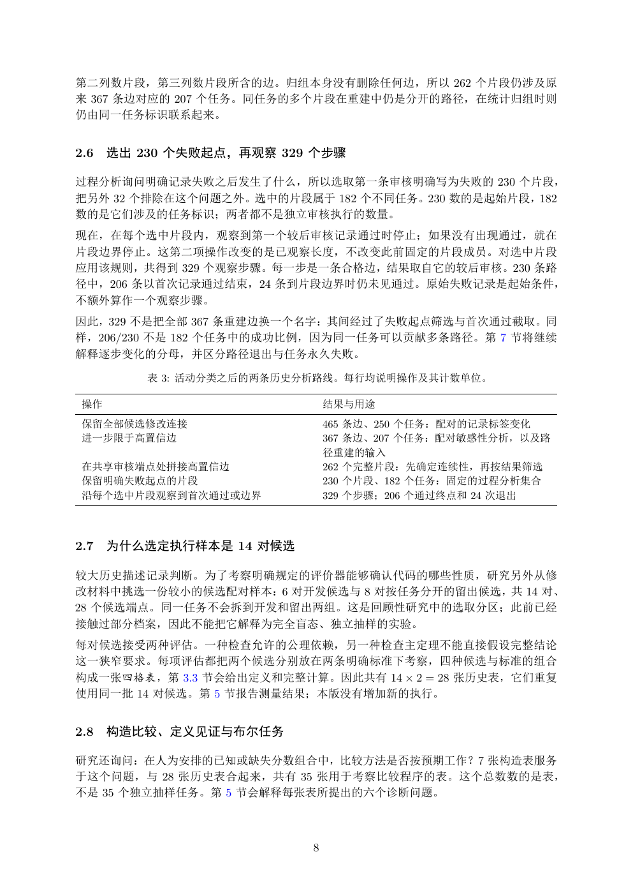

# PDF page 8



## Extracted text

```text
第二列数片段，第三列数片段所含的边。归组本身没有删除任何边，所以 262 个片段仍涉及原
来 367 条边对应的 207 个任务。同任务的多个片段在重建中仍是分开的路径，在统计归组时则
仍由同一任务标识联系起来。


2.6   选出 230 个失败起点，再观察 329 个步骤

过程分析询问明确记录失败之后发生了什么，所以选取第一条审核明确写为失败的 230 个片段，
把另外 32 个排除在这个问题之外。选中的片段属于 182 个不同任务。230 数的是起始片段，182
数的是它们涉及的任务标识；两者都不是独立审核执行的数量。
现在，在每个选中片段内，观察到第一个较后审核记录通过时停止；如果没有出现通过，就在
片段边界停止。这第二项操作改变的是已观察长度，不改变此前固定的片段成员。对选中片段
应用该规则，共得到 329 个观察步骤。每一步是一条合格边，结果取自它的较后审核。230 条路
径中，206 条以首次记录通过结束，24 条到片段边界时仍未见通过。原始失败记录是起始条件，
不额外算作一个观察步骤。
因此，329 不是把全部 367 条重建边换一个名字：其间经过了失败起点筛选与首次通过截取。同
样，206/230 不是 182 个任务中的成功比例，因为同一任务可以贡献多条路径。第 7 节将继续
解释逐步变化的分母，并区分路径退出与任务永久失败。

          表 3: 活动分类之后的两条历史分析路线。每行均说明操作及其计数单位。

 操作                           结果与用途
 保留全部候选修改连接                   465 条边、250 个任务：配对的记录标签变化
 进一步限于高置信边                    367 条边、207 个任务：配对敏感性分析，以及路
                              径重建的输入
 在共享审核端点处拼接高置信边               262 个完整片段：先确定连续性，再按结果筛选
 保留明确失败起点的片段                  230 个片段、182 个任务：固定的过程分析集合
 沿每个选中片段观察到首次通过或边界            329 个步骤；206 个通过终点和 24 次退出


2.7   为什么选定执行样本是 14 对候选

较大历史描述记录判断。为了考察明确规定的评价器能够确认代码的哪些性质，研究另外从修
改材料中挑选一份较小的候选配对样本：6 对开发候选与 8 对按任务分开的留出候选，共 14 对、
28 个候选端点。同一任务不会拆到开发和留出两组。这是回顾性研究中的选取分区；此前已经
接触过部分档案，因此不能把它解释为完全盲态、独立抽样的实验。
每对候选接受两种评估。一种检查允许的公理依赖，另一种检查主定理不能直接假设完整结论
这一狭窄要求。每项评估都把两个候选分别放在两条明确标准下考察，四种候选与标准的组合
构成一张四格表，第 3.3 节会给出定义和完整计算。因此共有 14 × 2 = 28 张历史表，它们重复
使用同一批 14 对候选。第 5 节报告测量结果；本版没有增加新的执行。


2.8   构造比较、定义见证与布尔任务

研究还询问：在人为安排的已知或缺失分数组合中，比较方法是否按预期工作？7 张构造表服务
于这个问题，与 28 张历史表合起来，共有 35 张用于考察比较程序的表。这个总数数的是表，
不是 35 个独立抽样任务。第 5 节会解释每张表所提出的六个诊断问题。


                          8
```
