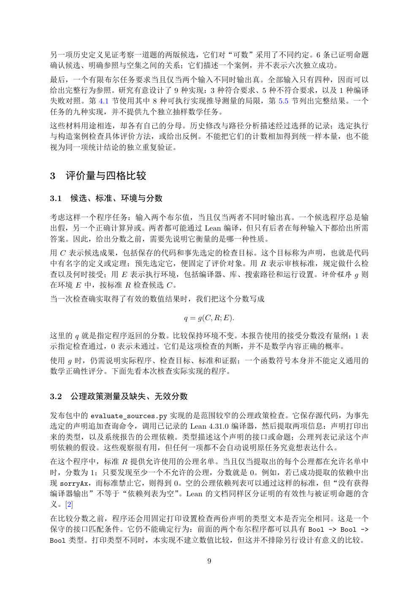

# PDF page 9



## Extracted text

```text
另一项历史定义见证考察一道题的两版候选，它们对“可数”采用了不同约定。6 条已证明命题
确认候选、明确参照与空集之间的关系；它们描述一个案例，并不表示六次独立成功。
最后，一个有限布尔任务要求当且仅当两个输入不同时输出真。全部输入只有四种，因而可以
给出完整行为参照。研究有意设计了 9 种实现：3 种符合要求、5 种不符合要求，以及 1 种编译
失败对照。第 4.1 节使用其中 8 种可执行实现推导测量的局限，第 5.5 节列出完整结果。一个
任务的九种实现，并不提供九个独立抽样数学任务。
这些材料用途相连，却各有自己的分母。历史修改与路径分析描述经过选择的记录；选定执行
与构造案例检查具体评价方法，或给出反例。不能把它们的计数相加得到统一样本量，也不能
视为同一项统计结论的独立重复验证。


3 评价量与四格比较

3.1   候选、标准、环境与分数

考虑这样一个程序任务：输入两个布尔值，当且仅当两者不同时输出真。一个候选程序总是输
出假，另一个正确计算异或。两者都可能通过 Lean 编译，但只有后者在每种输入下都给出所需
答案。因此，给出分数之前，需要先说明它衡量的是哪一种性质。
用 C 表示候选成果，包括保存的代码和事先选定的检查目标。这个目标称为声明，也就是代码
中有名字的定义或定理；预先选定它，便固定了评价对象。用 R 表示审核标准，规定做什么检
查以及何时接受；用 E 表示执行环境，包括编译器、库、搜索路径和运行设置。评价程序 g 则
在环境 E 中，按标准 R 检查候选 C。
当一次检查确实取得了有效的数值结果时，我们把这个分数写成

                     q = g(C, R; E).

这里的 q 就是指定程序返回的分数。比较保持环境不变。本报告使用的接受分数没有量纲：1 表
示指定检查通过，0 表示未通过。它们是这项检查的判断，并不是数学内容正确的概率。
使用 g 时，仍需说明实际程序、检查目标、标准和证据；一个函数符号本身并不能定义通用的
数学正确性评分。下面先看本次核查实际实现的程序。


3.2   公理政策测量及缺失、无效分数

发布包中的 evaluate_sources.py 实现的是范围较窄的公理政策检查。它保存源代码，为事先
选定的声明追加查询命令，调用已记录的 Lean 4.31.0 编译器，然后提取两项信息：声明打印出
来的类型，以及系统报告的公理依赖。类型描述这个声明的接口或命题；公理列表记录这个声
明依赖的假设。这些观察很有用，但任何一项都不会自动说明原任务究竟想表达什么。
在这个程序中，标准 R 提供允许使用的公理名单。当且仅当提取出的每个公理都在允许名单中
时，分数为 1；只要发现至少一个不允许的公理，分数就是 0。例如，若已成功提取的依赖中出
现 sorryAx，而标准禁止它，则得到 0。空的公理依赖列表可以通过这样的标准，但“没有获得
编译器输出”不等于“依赖列表为空”。Lean 的文档同样区分证明的有效性与被证明命题的含
义。[2]
在比较分数之前，程序还会用固定打印设置检查两份声明的类型文本是否完全相同。这是一个
保守的接口匹配条件。它仍不能确定行为：前面的两个布尔程序都可以具有 Bool -> Bool ->
Bool 类型。打印类型不同时，本实现不建立数值比较，但这并不排除另行设计有意义的比较。

                           9
```
