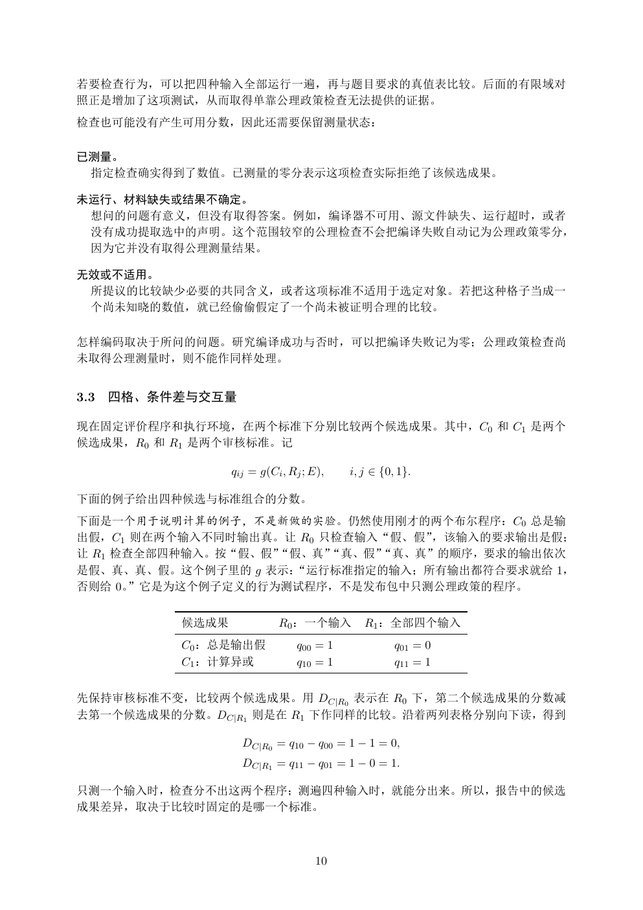

# PDF page 10



## Extracted text

```text
若要检查行为，可以把四种输入全部运行一遍，再与题目要求的真值表比较。后面的有限域对
照正是增加了这项测试，从而取得单靠公理政策检查无法提供的证据。
检查也可能没有产生可用分数，因此还需要保留测量状态：

已测量。
 指定检查确实得到了数值。已测量的零分表示这项检查实际拒绝了该候选成果。

未运行、材料缺失或结果不确定。
 想问的问题有意义，但没有取得答案。例如，编译器不可用、源文件缺失、运行超时，或者
 没有成功提取选中的声明。这个范围较窄的公理检查不会把编译失败自动记为公理政策零分，
 因为它并没有取得公理测量结果。

无效或不适用。
 所提议的比较缺少必要的共同含义，或者这项标准不适用于选定对象。若把这种格子当成一
 个尚未知晓的数值，就已经偷偷假定了一个尚未被证明合理的比较。

怎样编码取决于所问的问题。研究编译成功与否时，可以把编译失败记为零；公理政策检查尚
未取得公理测量时，则不能作同样处理。


3.3   四格、条件差与交互量

现在固定评价程序和执行环境，在两个标准下分别比较两个候选成果。其中，C0 和 C1 是两个
候选成果，R0 和 R1 是两个审核标准。记

                  qij = g(Ci , Rj ; E),   i, j ∈ {0, 1}.

下面的例子给出四种候选与标准组合的分数。
下面是一个用于说明计算的例子，不是新做的实验。仍然使用刚才的两个布尔程序：C0 总是输
出假，C1 则在两个输入不同时输出真。让 R0 只检查输入“假、假”，该输入的要求输出是假；
让 R1 检查全部四种输入。按“假、假”
                   “假、真” “真、假”
                             “真、真”的顺序，要求的输出依次
是假、真、真、假。这个例子里的 g 表示：“运行标准指定的输入；所有输出都符合要求就给 1，
否则给 0。”它是为这个例子定义的行为测试程序，不是发布包中只测公理政策的程序。


           候选成果             R0 ：一个输入         R1 ：全部四个输入
           C0 ：总是输出假            q00 = 1             q01 = 0
           C1 ：计算异或             q10 = 1             q11 = 1


先保持审核标准不变，比较两个候选成果。用 DC|R0 表示在 R0 下，第二个候选成果的分数减
去第一个候选成果的分数。DC|R1 则是在 R1 下作同样的比较。沿着两列表格分别向下读，得到

                    DC|R0 = q10 − q00 = 1 − 1 = 0,
                    DC|R1 = q11 − q01 = 1 − 0 = 1.

只测一个输入时，检查分不出这两个程序；测遍四种输入时，就能分出来。所以，报告中的候选
成果差异，取决于比较时固定的是哪一个标准。


                                    10
```
