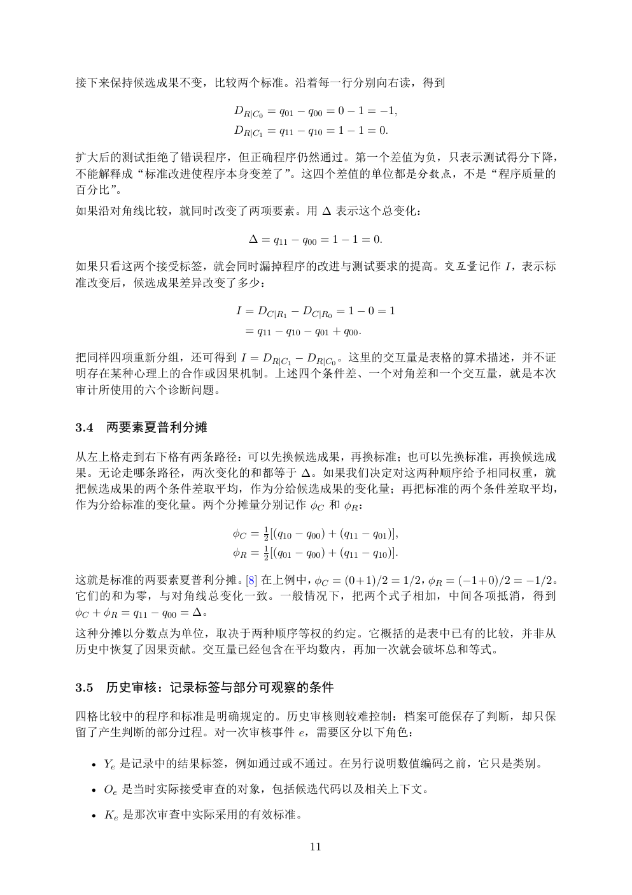

# PDF page 11



## Extracted text

```text
接下来保持候选成果不变，比较两个标准。沿着每一行分别向右读，得到

                    DR|C0 = q01 − q00 = 0 − 1 = −1,
                    DR|C1 = q11 − q10 = 1 − 1 = 0.

扩大后的测试拒绝了错误程序，但正确程序仍然通过。第一个差值为负，只表示测试得分下降，
不能解释成“标准改进使程序本身变差了”。这四个差值的单位都是分数点，不是“程序质量的
百分比”。
如果沿对角线比较，就同时改变了两项要素。用 ∆ 表示这个总变化：

                       ∆ = q11 − q00 = 1 − 1 = 0.

如果只看这两个接受标签，就会同时漏掉程序的改进与测试要求的提高。交互量记作 I，表示标
准改变后，候选成果差异改变了多少：

                     I = DC|R1 − DC|R0 = 1 − 0 = 1
                      = q11 − q10 − q01 + q00 .

把同样四项重新分组，还可得到 I = DR|C1 − DR|C0 。这里的交互量是表格的算术描述，并不证
明存在某种心理上的合作或因果机制。上述四个条件差、一个对角差和一个交互量，就是本次
审计所使用的六个诊断问题。


3.4   两要素夏普利分摊

从左上格走到右下格有两条路径：可以先换候选成果，再换标准；也可以先换标准，再换候选成
果。无论走哪条路径，两次变化的和都等于 ∆。如果我们决定对这两种顺序给予相同权重，就
把候选成果的两个条件差取平均，作为分给候选成果的变化量；再把标准的两个条件差取平均，
作为分给标准的变化量。两个分摊量分别记作 ϕC 和 ϕR ：

                    ϕC = 12 [(q10 − q00 ) + (q11 − q01 )],
                    ϕR = 21 [(q01 − q00 ) + (q11 − q10 )].

这就是标准的两要素夏普利分摊。[8] 在上例中，ϕC = (0+1)/2 = 1/2，ϕR = (−1+0)/2 = −1/2。
它们的和为零，与对角线总变化一致。一般情况下，把两个式子相加，中间各项抵消，得到
ϕC + ϕR = q11 − q00 = ∆。
这种分摊以分数点为单位，取决于两种顺序等权的约定。它概括的是表中已有的比较，并非从
历史中恢复了因果贡献。交互量已经包含在平均数内，再加一次就会破坏总和等式。


3.5   历史审核：记录标签与部分可观察的条件

四格比较中的程序和标准是明确规定的。历史审核则较难控制：档案可能保存了判断，却只保
留了产生判断的部分过程。对一次审核事件 e，需要区分以下角色：

  • Ye 是记录中的结果标签，例如通过或不通过。在另行说明数值编码之前，它只是类别。

  • Oe 是当时实际接受审查的对象，包括候选代码以及相关上下文。

  • Ke 是那次审查中实际采用的有效标准。

                                     11
```
