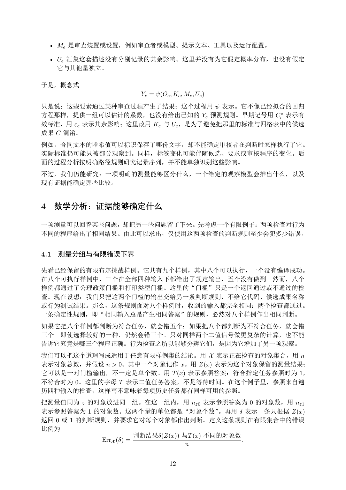

# PDF page 12



## Extracted text

```text
  • Me 是审查装置或设置，例如审查者或模型、提示文本、工具以及运行配置。

  • Ue 汇集这套描述没有分别记录的其余影响。这里并没有为它假定概率分布，也没有假定
    它与其他量独立。

于是，概念式
                    Ye = ψ(Oe , Ke , Me , Ue )
只是说：这些要素通过某种审查过程产生了结果；这个过程用 ψ 表示。它不像已经拟合的回归
方程那样，提供一组可以估计的系数，也没有给出已知的 Ye 预测规则。早期记号用 Ce∗ 表示有
效标准，用 εe 表示其余影响；这里改用 Ke 与 Ue ，是为了避免把那里的标准与四格表中的候选
成果 C 混淆。
例如，合同文本的哈希值可以标识保存了哪份文字，却不能确定审核者在判断时怎样执行了它。
实际标准仍可能只被部分观察到。同样，标签变化可能伴随候选、要求或审核程序的变化。后
面的过程分析按明确路径规则研究记录序列，并不能单独识别这些影响。
不过，我们仍能研究：一项明确的测量能够区分什么，一个给定的观察模型会推出什么，以及
现有证据能确定哪些比较。


4 数学分析：证据能够确定什么

一项测量可以回答某些问题，却把另一些问题留了下来。先考虑一个有限例子：两项检查对行为
不同的程序给出了相同结果。由此可以求出，仅使用这两项检查的判断规则至少会犯多少错误。


4.1   测量分组与有限错误下界

先看已经保留的有限布尔挑战样例。它共有九个样例，其中八个可以执行，一个没有编译成功。
在八个可执行样例中，三个在全部四种输入下都给出了规定输出，五个没有做到。然而，八个
样例都通过了公理政策门槛和打印类型门槛。这里的“门槛”只是一个返回通过或不通过的检
查。现在设想：我们只把这两个门槛的输出交给另一条判断规则，不给它代码、候选成果名称
或行为测试结果。那么，这条规则面对八个样例时，收到的输入都完全相同：两个检查都通过。
一条确定性规则，即“相同输入总是产生相同答案”的规则，必然对八个样例作出相同判断。
如果它把八个样例都判断为符合任务，就会错五个；如果把八个都判断为不符合任务，就会错
三个。即使选择较好的一种，仍然会错三个。只对同样两个二值信号做更复杂的计算，也不能
告诉它究竟是哪三个程序正确。行为检查之所以能够分辨它们，是因为它增加了另一项观察。
我们可以把这个道理写成适用于任意有限样例集的结论。用 X 表示正在检查的对象集合，用 n
表示对象总数，并假设 n > 0。其中一个对象记作 x。用 Z(x) 表示为这个对象保留的测量结果；
它可以是一对门槛输出，不一定是单个数。用 T (x) 表示参照答案：符合指定任务参照时为 1，
不符合时为 0。这里的字母 T 表示二值任务答案，不是等待时间。在这个例子里，参照来自遍
历四种输入的检查；这样写不意味着每项历史任务都有同样可用的参照。
把测量值同为 z 的对象放进同一组。在这一组内，用 nz0 表示参照答案为 0 的对象数，用 nz1
表示参照答案为 1 的对象数。这两个量的单位都是“对象个数”。再用 δ 表示一条只根据 Z(x)
返回 0 或 1 的判断规则，并要求它对每个对象都作出判断。定义这条规则在有限集合中的错误
比例为
                        判断结果δ(Z(x)) 与T (x) 不同的对象数
             ErrX (δ) =                           .
                                     n


                               12
```
