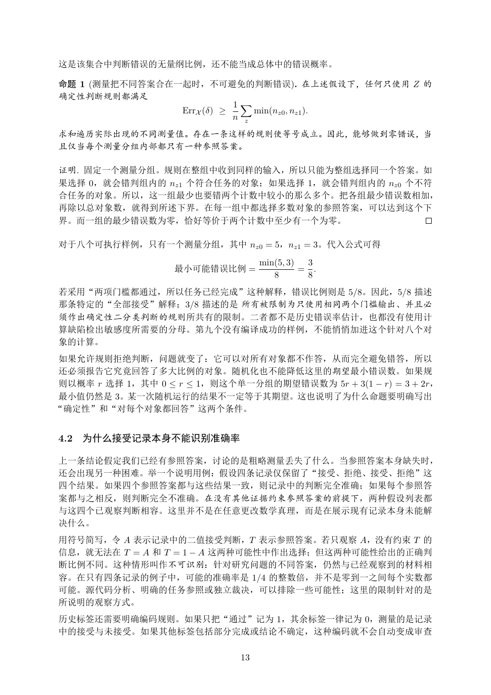

# PDF page 13



## Extracted text

```text
这是该集合中判断错误的无量纲比例，还不能当成总体中的错误概率。

命题 1 (测量把不同答案合在一起时，不可避免的判断错误). 在上述假设下，任何只使用 Z 的
确定性判断规则都满足
                           1X
                ErrX (δ) ≥     min(nz0 , nz1 ).
                           n z
求和遍历实际出现的不同测量值。存在一条这样的规则使等号成立。因此，能够做到零错误，当
且仅当每个测量分组内部都只有一种参照答案。

证明. 固定一个测量分组。规则在整组中收到同样的输入，所以只能为整组选择同一个答案。如
果选择 0，就会错判组内的 nz1 个符合任务的对象；如果选择 1，就会错判组内的 nz0 个不符
合任务的对象。所以，这一组最少也要错两个计数中较小的那么多个。把各组最少错误数相加，
再除以总对象数，就得到所述下界。在每一组中都选择多数对象的参照答案，可以达到这个下
界。而一组的最少错误数为零，恰好等价于两个计数中至少有一个为零。

对于八个可执行样例，只有一个测量分组，其中 nz0 = 5，nz1 = 3。代入公式可得
                                   min(5, 3)  3
                   最小可能错误比例 =                = .
                                      8       8
若采用“两项门槛都通过，所以任务已经完成”这种解释，错误比例则是 5/8。因此，5/8 描述
那条特定的“全部接受”解释；3/8 描述的是 所有被限制为只使用相同两个门槛输出、并且必
须作出确定性二分类判断的规则所共有的限制。二者都不是历史错误率估计，也都没有使用计
算缺陷检出敏感度所需要的分母。第九个没有编译成功的样例，不能悄悄加进这个针对八个对
象的计算。
如果允许规则拒绝判断，问题就变了：它可以对所有对象都不作答，从而完全避免错答，所以
还必须报告它究竟回答了多大比例的对象。随机化也不能降低这里的期望最小错误数。如果规
则以概率 r 选择 1，其中 0 ≤ r ≤ 1，则这个单一分组的期望错误数为 5r + 3(1 − r) = 3 + 2r，
最小值仍然是 3。某一次随机运行的结果不一定等于其期望。这也说明了为什么命题要明确写出
“确定性”和“对每个对象都回答”这两个条件。


4.2   为什么接受记录本身不能识别准确率

上一条结论假定我们已经有参照答案，讨论的是粗略测量丢失了什么。当参照答案本身缺失时，
还会出现另一种困难。举一个说明用例：假设四条记录仅保留了“接受、拒绝、接受、拒绝”这
四个结果。如果四个参照答案都与这些结果一致，则记录中的判断完全准确；如果每个参照答
案都与之相反，则判断完全不准确。在没有其他证据约束参照答案的前提下，两种假设列表都
与这四个已观察判断相容。这里并不是在任意更改数学真理，而是在展示现有记录本身未能解
决什么。
用符号简写，令 A 表示记录中的二值接受判断，T 表示参照答案。若只观察 A，没有约束 T 的
信息，就无法在 T = A 和 T = 1 − A 这两种可能性中作出选择；但这两种可能性给出的正确判
断比例不同。这种情形叫作不可识别：针对研究问题的不同答案，仍然与已经观察到的材料相
容。在只有四条记录的例子中，可能的准确率是 1/4 的整数倍，并不是零到一之间每个实数都
可能。源代码分析、明确的任务参照或独立裁决，可以排除一些可能性；这里的限制针对的是
所说明的观察方式。
历史标签还需要明确编码规则。如果只把“通过”记为 1，其余标签一律记为 0，测量的是记录
中的接受与未接受。如果其他标签包括部分完成或结论不确定，这种编码就不会自动变成审查

                              13
```
