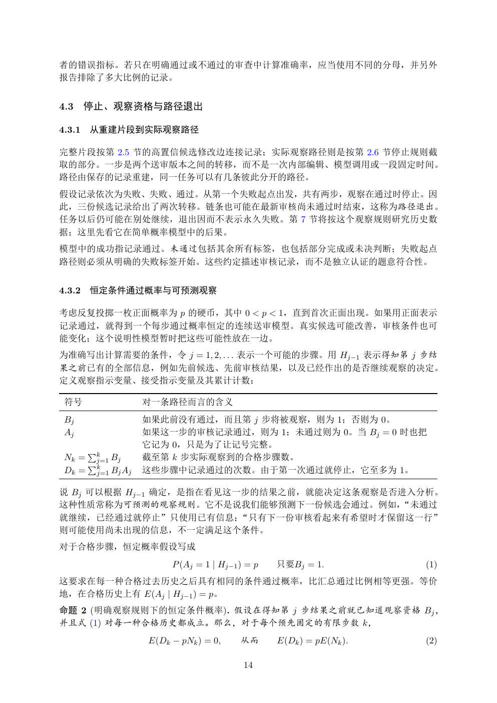

# PDF page 14



## Extracted text

```text
者的错误指标。若只在明确通过或不通过的审查中计算准确率，应当使用不同的分母，并另外
报告排除了多大比例的记录。


4.3     停止、观察资格与路径退出

4.3.1   从重建片段到实际观察路径

完整片段按第 2.5 节的高置信候选修改边连接记录；实际观察路径则是按第 2.6 节停止规则截
取的部分。一步是两个送审版本之间的转移，而不是一次内部编辑、模型调用或一段固定时间。
路径由保存的记录重建，同一任务可以有几条彼此分开的路径。
假设记录依次为失败、失败、通过。从第一个失败起点出发，共有两步，观察在通过时停止。因
此，三份候选记录给出了两次转移。链条也可能在最新审核尚未通过时结束，这称为路径退出。
任务以后仍可能在别处继续，退出因而不表示永久失败。第 7 节将按这个观察规则研究历史数
据；这里先看它在简单概率模型中的后果。
模型中的成功指记录通过。未通过包括其余所有标签，也包括部分完成或未决判断；失败起点
路径则必须从明确的失败标签开始。这些约定描述审核记录，而不是独立认证的题意符合性。


4.3.2   恒定条件通过概率与可预测观察

考虑反复投掷一枚正面概率为 p 的硬币，其中 0 < p < 1，直到首次正面出现。如果用正面表示
记录通过，就得到一个每步通过概率恒定的连续送审模型。真实候选可能改善，审核条件也可
能变化；这个说明性模型暂时把这些可能性放在一边。
为准确写出计算需要的条件，令 j = 1, 2, . . . 表示一个可能的步骤。用 Hj−1 表示得知第 j 步结
果之前已有的全部信息，例如先前候选、先前审核结果，以及已经作出的是否继续观察的决定。
定义观察指示变量、接受指示变量及其累计计数：

 符号                对一条路径而言的含义
 Bj                如果此前没有通过，而且第 j 步将被观察，则为 1；否则为 0。
 Aj                如果这一步的审核记录通过，则为 1；未通过则为 0。当 Bj = 0 时也把
                   它记为 0，只是为了让记号完整。
        P
 Nk = kj=1 Bj      截至第 k 步实际观察到的合格步骤数。
     P
 Dk = kj=1 Bj Aj   这些步骤中记录通过的次数。由于第一次通过就停止，它至多为 1。

说 Bj 可以根据 Hj−1 确定，是指在看见这一步的结果之前，就能决定这条观察是否进入分析。
这种性质常称为可预测的观察规则。它不是说我们能够预测下一份候选会通过。例如，“未通过
就继续，已经通过就停止”只使用已有信息；“只有下一份审核看起来有希望时才保留这一行”
则可能使用尚未出现的信息，不一定满足这个条件。
对于合格步骤，恒定概率假设写成
                        P (Aj = 1 | Hj−1 ) = p   只要Bj = 1.           (1)
这要求在每一种合格过去历史之后具有相同的条件通过概率，比汇总通过比例相等更强。等价
地，在合格历史上有 E(Aj | Hj−1 ) = p。
命题 2 (明确观察规则下的恒定条件概率). 假设在得知第 j 步结果之前就已知道观察资格 Bj ，
并且式 (1) 对每一种合格历史都成立。那么，对于每个预先固定的有限步数 k，
                   E(Dk − pNk ) = 0,     从而      E(Dk ) = pE(Nk ).   (2)

                                          14
```
