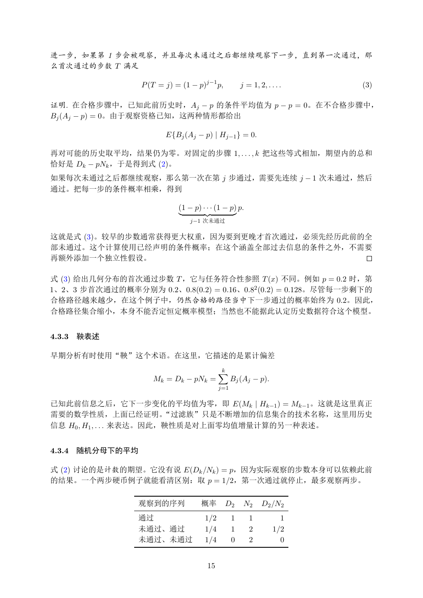

# PDF page 15



## Extracted text

```text
进一步，如果第 1 步会被观察，并且每次未通过之后都继续观察下一步，直到第一次通过，那
么首次通过的步数 T 满足

                   P (T = j) = (1 − p)j−1 p,            j = 1, 2, . . . .   (3)

证明. 在合格步骤中，已知此前历史时，Aj − p 的条件平均值为 p − p = 0。在不合格步骤中，
Bj (Aj − p) = 0。由于观察资格已知，这两种情形都给出

                          E{Bj (Aj − p) | Hj−1 } = 0.

再对可能的历史取平均，结果仍为零。对固定的步骤 1, . . . , k 把这些等式相加，期望内的总和
恰好是 Dk − pNk ，于是得到式 (2)。
如果每次未通过之后都继续观察，那么第一次在第 j 步通过，需要先连续 j − 1 次未通过，然后
通过。把每一步的条件概率相乘，得到

                              (1 − p) · · · (1 − p) p.
                              |        {z           }
                                  j−1 次未通过

这就是式 (3)。较早的步数通常获得更大权重，因为要到更晚才首次通过，必须先经历此前的全
部未通过。这个计算使用已经声明的条件概率；在这个涵盖全部过去信息的条件之外，不需要
再额外添加一个独立性假设。

式 (3) 给出几何分布的首次通过步数 T ，它与任务符合性参照 T (x) 不同。例如 p = 0.2 时，第
1、2、3 步首次通过的概率分别为 0.2、0.8(0.2) = 0.16、0.82 (0.2) = 0.128。尽管每一步剩下的
合格路径越来越少，在这个例子中，仍然合格的路径当中下一步通过的概率始终为 0.2。因此，
合格路径集合缩小，本身不能否定恒定概率模型；当然也不能据此认定历史数据符合这个模型。


4.3.3   鞅表述

早期分析有时使用“鞅”这个术语。在这里，它描述的是累计偏差

                                             X
                                             k
                      Mk = Dk − pNk =              Bj (Aj − p).
                                             j=1

已知此前信息之后，它下一步变化的平均值为零，即 E(Mk | Hk−1 ) = Mk−1 。这就是这里真正
需要的数学性质，上面已经证明。“过滤族”只是不断增加的信息集合的技术名称，这里用历史
信息 H0 , H1 , . . . 来表达。因此，鞅性质是对上面零均值增量计算的另一种表述。


4.3.4   随机分母下的平均

式 (2) 讨论的是计数的期望。它没有说 E(Dk /Nk ) = p，因为实际观察的步数本身可以依赖此前
的结果。一个两步硬币例子就能看清区别：取 p = 1/2，第一次通过就停止，最多观察两步。

                   观察到的序列             概率       D2        N2     D2 /N2
                   通过                  1/2         1       1           1
                   未通过、通过              1/4         1       2         1/2
                   未通过、未通过             1/4         0       2           0


                                        15
```
