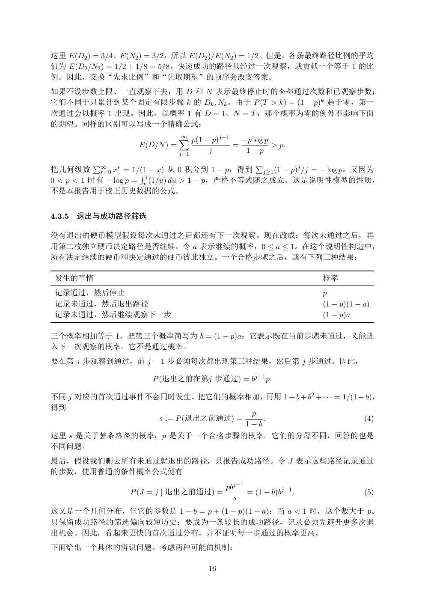

# PDF page 16



## Extracted text

```text
这里 E(D2 ) = 3/4、E(N2 ) = 3/2，所以 E(D2 )/E(N2 ) = 1/2。但是，各条最终路径比例的平均
值为 E(D2 /N2 ) = 1/2 + 1/8 = 5/8。快速成功的路径只经过一次观察，就贡献一个等于 1 的比
例。因此，交换“先求比例”和“先取期望”的顺序会改变答案。
如果不设步数上限、一直观察下去，用 D 和 N 表示最终停止时的全部通过次数和已观察步数；
它们不同于只累计到某个固定有限步骤 k 的 Dk , Nk 。由于 P (T > k) = (1 − p)k 趋于零，第一
次通过会以概率 1 出现。因此，以概率 1 有 D = 1、N = T ，那个概率为零的例外不影响下面
的期望。同样的区别可以写成一个精确公式：
                                ∞
                                X p(1 − p)j−1       −p log p
                    E(D/N ) =                   =            > p.
                                j=1
                                       j             1−p
          P                                             P
把几何级数 ∞     r=0 x = 1/(1 − x) 从 0 积分到 1 − p，得到
                 r
                                                j≥1 (1 − p) /j = − log p。又因为
                                                           j
                      R1
0 < p < 1 时有 − log p = p (1/u) du > 1 − p，严格不等式随之成立。这是说明性模型的性质，
不是本报告用于校正历史数据的公式。


4.3.5   退出与成功路径筛选

没有退出的硬币模型假设每次未通过之后都还有下一次观察。现在改成：每次未通过之后，再
用第二枚独立硬币决定路径是否继续。令 a 表示继续的概率，0 ≤ a ≤ 1。在这个说明性构造中，
所有决定继续的硬币和决定通过的硬币彼此独立。一个合格步骤之后，就有下列三种结果：

 发生的事情                                                              概率
 记录通过，然后停止                                                          p
 记录未通过，然后退出路径                                                       (1 − p)(1 − a)
 记录未通过，然后继续观察下一步                                                    (1 − p)a

三个概率相加等于 1。把第三个概率简写为 b = (1 − p)a：它表示既在当前步骤未通过，又能进
入下一次观察的概率。它不是通过概率。
要在第 j 步观察到通过，前 j − 1 步必须每次都出现第三种结果，然后第 j 步通过。因此，

                       P (退出之前在第j 步通过) = bj−1 p.

不同 j 对应的首次通过事件不会同时发生。把它们的概率相加，再用 1 + b + b2 + · · · = 1/(1 − b)，
得到
                                   p
                s := P (退出之前通过) =     .                     (4)
                                  1−b
这里 s 是关于整条路径的概率；p 是关于一个合格步骤的概率。它们的分母不同，回答的也是
不同问题。
最后，假设我们删去所有未通过就退出的路径，只报告成功路径。令 J 表示这些路径记录通过
的步数，使用普通的条件概率公式便有
                                            pbj−1
                  P (J = j | 退出之前通过) =            = (1 − b)bj−1 .               (5)
                                              s
这又是一个几何分布，但它的参数是 1 − b = p + (1 − p)(1 − a)；当 a < 1 时，这个数大于 p。
只保留成功路径的筛选偏向较短历史：要成为一条较长的成功路径，记录必须先避开更多次退
出机会。因此，看起来更快的首次通过分布，并不证明每一步通过的概率更高。
下面给出一个具体的辨识问题。考虑两种可能的机制：

                                       16
```
