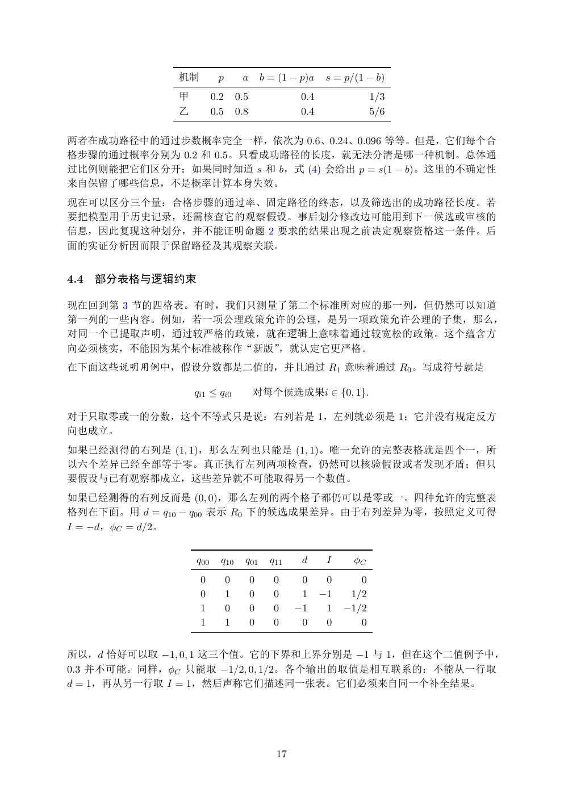

# PDF page 17



## Extracted text

```text
              机制         p         a        b = (1 − p)a    s = p/(1 − b)
              甲         0.2       0.5                0.4               1/3
              乙         0.5       0.8                0.4               5/6

两者在成功路径中的通过步数概率完全一样，依次为 0.6、0.24、0.096 等等。但是，它们每个合
格步骤的通过概率分别为 0.2 和 0.5。只看成功路径的长度，就无法分清是哪一种机制。总体通
过比例则能把它们区分开：如果同时知道 s 和 b，式 (4) 会给出 p = s(1 − b)。这里的不确定性
来自保留了哪些信息，不是概率计算本身失效。
现在可以区分三个量：合格步骤的通过率、固定路径的终态，以及筛选出的成功路径长度。若
要把模型用于历史记录，还需核查它的观察假设。事后划分修改边可能用到下一候选或审核的
信息，因此复现这种划分，并不能证明命题 2 要求的结果出现之前决定观察资格这一条件。后
面的实证分析因而限于保留路径及其观察关联。


4.4   部分表格与逻辑约束

现在回到第 3 节的四格表。有时，我们只测量了第二个标准所对应的那一列，但仍然可以知道
第一列的一些内容。例如，若一项公理政策允许的公理，是另一项政策允许公理的子集，那么，
对同一个已提取声明，通过较严格的政策，就在逻辑上意味着通过较宽松的政策。这个蕴含方
向必须核实，不能因为某个标准被称作“新版”，就认定它更严格。
在下面这些说明用例中，假设分数都是二值的，并且通过 R1 意味着通过 R0 。写成符号就是

                  qi1 ≤ qi0             对每个候选成果i ∈ {0, 1}.

对于只取零或一的分数，这个不等式只是说：右列若是 1，左列就必须是 1；它并没有规定反方
向也成立。
如果已经测得的右列是 (1, 1)，那么左列也只能是 (1, 1)。唯一允许的完整表格就是四个一，所
以六个差异已经全部等于零。真正执行左列两项检查，仍然可以核验假设或者发现矛盾；但只
要假设与已有观察都成立，这些差异就不可能取得另一个数值。
如果已经测得的右列反而是 (0, 0)，那么左列的两个格子都仍可以是零或一。四种允许的完整表
格列在下面。用 d = q10 − q00 表示 R0 下的候选成果差异。由于右列差异为零，按照定义可得
I = −d，ϕC = d/2。


                  q00     q10       q01       q11    d      I     ϕC
                   0          0         0      0     0      0      0
                   0          1         0      0     1     −1    1/2
                   1          0         0      0    −1      1   −1/2
                   1          1         0      0     0      0      0


所以，d 恰好可以取 −1, 0, 1 这三个值。它的下界和上界分别是 −1 与 1，但在这个二值例子中，
0.3 并不可能。同样，ϕC 只能取 −1/2, 0, 1/2。各个输出的取值是相互联系的：不能从一行取
d = 1，再从另一行取 I = 1，然后声称它们描述同一张表。它们必须来自同一个补全结果。


                                               17
```
