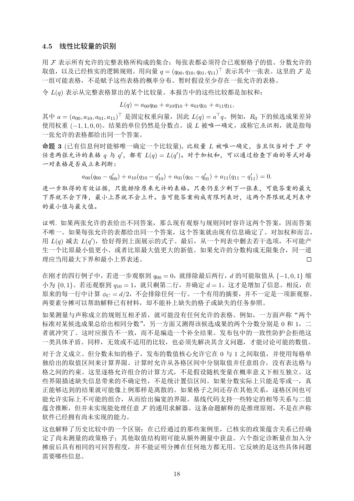

# PDF page 18



## Extracted text

```text
4.5   线性比较量的识别

用 F 表示所有允许的完整表格所构成的集合：每张表都必须符合已观察格子的值、分数允许的
取值，以及已经核实的逻辑规则。用向量 q = (q00 , q10 , q01 , q11 )⊤ 表示其中一张表。这里的 F 是
一组可能表格，不是赋予这些表格的概率分布。暂时假设至少存在一张允许的表格。
令 L(q) 表示从完整表格算出的某个比较量。本报告中的这些比较都是加权和：
                         L(q) = a00 q00 + a10 q10 + a01 q01 + a11 q11 ,
其中 a = (a00 , a10 , a01 , a11 )⊤ 是固定权重向量，因此 L(q) = a⊤ q。例如，R0 下的候选成果差异
使用权重 (−1, 1, 0, 0)。结果的单位仍然是分数点。说 L 被唯一确定，或称它点识别，就是指每
一张允许的表格都给出同一个答案。
命题 3 (已有信息何时能够唯一确定一个比较量). 比较量 L 被唯一确定，当且仅当对于 F 中
任意两张允许的表格 q 与 q ′ ，都有 L(q) = L(q ′ )。对于加权和，可以通过检查下面的等式对每
一对表格是否成立来判断：
                      ′                  ′                  ′                  ′
          a00 (q00 − q00 ) + a10 (q10 − q10 ) + a01 (q01 − q01 ) + a11 (q11 − q11 ) = 0.
进一步取得的有效证据，只能排除原来允许的表格。只要仍至少剩下一张表，可能答案的最大
下界就不会下降，最小上界就不会上升。当可能答案构成有限列表时，这两个界限就是列表中
的最小值与最大值。

证明. 如果两张允许的表给出不同答案，那么现有观察与规则同时容许这两个答案，因而答案
不唯一。如果每张允许的表都给出同一个答案，这个答案就由现有信息确定了。对加权和而言，
用 L(q) 减去 L(q ′ )，恰好得到上面展示的式子。最后，从一个列表中删去若干选项，不可能产
生一个比原最小值更小、或者比原最大值更大的新值。如果允许的分数构成无限集合，同一道
理应当用最大下界和最小上界表述。

在刚才的四行例子中，若进一步观察到 q00 = 0，就排除最后两行，d 的可能取值从 {−1, 0, 1} 缩
小为 {0, 1}。若还观察到 q10 = 1，就只剩第二行，并确定 d = 1。这才是增加了信息。相反，在
原来的每一行中计算 ϕC = d/2，不会排除任何一行。一个有用的摘要，并不一定是一项新观察。
两要素分摊可以帮助解释已有材料，却不能补上缺失的格子或缺失的任务参照。
如果测量与声称成立的规则互相矛盾，就可能没有任何允许的表格。例如，一方面声称“两个
标准对某候选成果总给出相同分数”，另一方面又测得该候选成果的两个分数分别是 0 和 1，二
者就冲突了。这时应报告不一致，而不是编造一个补全结果。发布包中的一致性防护会拒绝这
一类具体矛盾。同样，无效或不适用的比较，也必须先解决其含义问题，才能讨论可能的数值。
对于含义成立、但分数未知的格子，发布的数值核心允许它在 0 与 1 之间取值，并使用每格单
独给出的取值区间来计算界限。计算时允许从各格区间中分别取值并任意组合，没有表达格与
格之间的约束。这里逐格允许组合的计算方式，不是假设随机变量在概率意义下相互独立。这
些界限描述缺失信息带来的不确定性，不是统计置信区间。如果分数实际上只能是零或一，真
正能够达到的结果就可能像上例那样是离散的。如果格子之间还存在其他关系，逐格区间也可
能允许实际上不可能的组合，从而给出偏宽的界限。基线代码支持一些特定的相等关系与二值
蕴含推断，但并未实现能处理任意 F 的通用求解器。这条命题解释的是推理原则，不是在声称
软件已经拥有尚未实现的能力。
这也解释了历史比较中的一个区别：在已经通过的那些案例里，已核实的政策蕴含关系已经确
定了尚未测量的政策格子；其他取值结构则可能从额外测量中获益。六个指定诊断量在加入分
摊前后具有相同的可回答程度，并不能证明分摊在任何地方都无用。它反映的是这些具体问题
需要哪些信息。

                                               18
```
