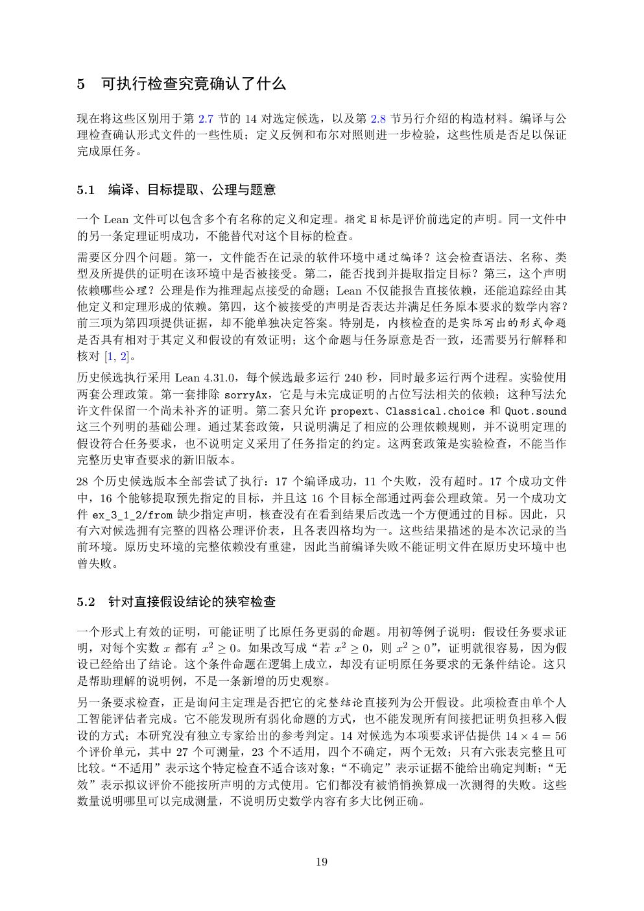

# PDF page 19



## Extracted text

```text
5 可执行检查究竟确认了什么

现在将这些区别用于第 2.7 节的 14 对选定候选，以及第 2.8 节另行介绍的构造材料。编译与公
理检查确认形式文件的一些性质；定义反例和布尔对照则进一步检验，这些性质是否足以保证
完成原任务。


5.1   编译、目标提取、公理与题意

一个 Lean 文件可以包含多个有名称的定义和定理。指定目标是评价前选定的声明。同一文件中
的另一条定理证明成功，不能替代对这个目标的检查。
需要区分四个问题。第一，文件能否在记录的软件环境中通过编译？这会检查语法、名称、类
型及所提供的证明在该环境中是否被接受。第二，能否找到并提取指定目标？第三，这个声明
依赖哪些公理？公理是作为推理起点接受的命题；Lean 不仅能报告直接依赖，还能追踪经由其
他定义和定理形成的依赖。第四，这个被接受的声明是否表达并满足任务原本要求的数学内容？
前三项为第四项提供证据，却不能单独决定答案。特别是，内核检查的是实际写出的形式命题
是否具有相对于其定义和假设的有效证明；这个命题与任务原意是否一致，还需要另行解释和
核对 [1, 2]。
历史候选执行采用 Lean 4.31.0，每个候选最多运行 240 秒，同时最多运行两个进程。实验使用
两套公理政策。第一套排除 sorryAx，它是与未完成证明的占位写法相关的依赖；这种写法允
许文件保留一个尚未补齐的证明。第二套只允许 propext、Classical.choice 和 Quot.sound
这三个列明的基础公理。通过某套政策，只说明满足了相应的公理依赖规则，并不说明定理的
假设符合任务要求，也不说明定义采用了任务指定的约定。这两套政策是实验检查，不能当作
完整历史审查要求的新旧版本。
28 个历史候选版本全部尝试了执行：17 个编译成功，11 个失败，没有超时。17 个成功文件
中，16 个能够提取预先指定的目标，并且这 16 个目标全部通过两套公理政策。另一个成功文
件 ex_3_1_2/from 缺少指定声明，核查没有在看到结果后改选一个方便通过的目标。因此，只
有六对候选拥有完整的四格公理评价表，且各表四格均为一。这些结果描述的是本次记录的当
前环境。原历史环境的完整依赖没有重建，因此当前编译失败不能证明文件在原历史环境中也
曾失败。


5.2   针对直接假设结论的狭窄检查

一个形式上有效的证明，可能证明了比原任务更弱的命题。用初等例子说明：假设任务要求证
明，对每个实数 x 都有 x2 ≥ 0。如果改写成“若 x2 ≥ 0，则 x2 ≥ 0”，证明就很容易，因为假
设已经给出了结论。这个条件命题在逻辑上成立，却没有证明原任务要求的无条件结论。这只
是帮助理解的说明例，不是一条新增的历史观察。
另一条要求检查，正是询问主定理是否把它的完整结论直接列为公开假设。此项检查由单个人
工智能评估者完成。它不能发现所有弱化命题的方式，也不能发现所有间接把证明负担移入假
设的方式；本研究没有独立专家给出的参考判定。14 对候选为本项要求评估提供 14 × 4 = 56
个评价单元，其中 27 个可测量，23 个不适用，四个不确定，两个无效；只有六张表完整且可
比较。“不适用”表示这个特定检查不适合该对象；“不确定”表示证据不能给出确定判断；“无
效”表示拟议评价不能按所声明的方式使用。它们都没有被悄悄换算成一次测得的失败。这些
数量说明哪里可以完成测量，不说明历史数学内容有多大比例正确。


                            19
```
