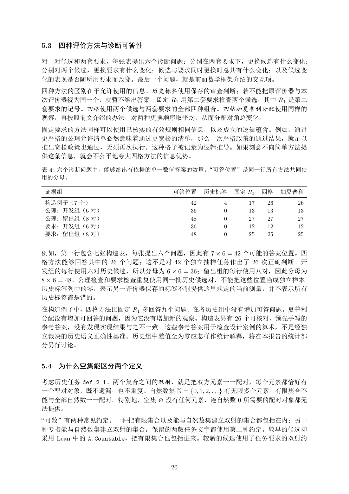

# PDF page 20



## Extracted text

```text
5.3   四种评价方法与诊断可答性

对一对候选和两套要求，每张表提出六个诊断问题：分别在两套要求下，更换候选有什么变化；
分别对两个候选，更换要求有什么变化；候选与要求同时更换时总共有什么变化；以及候选变
化的表现是否随所用要求而改变。最后一个问题，就是前面数学框架介绍的交互项。
四种方法的区别在于允许使用的信息。历史标签使用保存的审查判断；若不能把原评价器与本
次评价器视为同一个，就暂不给出答案。固定 R1 用第二套要求检查两个候选，其中 R1 是第二
套要求的记号。四格使用两个候选与两套要求的全部四种组合。四格加夏普利分配使用同样的
观察，再按照前文介绍的办法，对两种更换顺序取平均，从而分配对角总变化。
固定要求的方法同样可以使用已核实的有效规则相同信息，以及成立的逻辑蕴含。例如，通过
更严格的公理允许清单必然意味着通过更宽松的清单，那么一次严格政策的通过结果，就足以
推出宽松政策也通过，无须再次执行。这种格子被记录为逻辑推导。如果刻意不向简单方法提
供这条信息，就会不公平地夸大四格方法的信息优势。

表 4: 六个诊断问题中，能够给出有依据的单一数值答案的数量。“可答位置”是同一行所有方法共同使
用的分母。

 证据组                       可答位置      历史标签   固定 R1   四格   加夏普利
 构造例子（7 个）                      42      4      17   26      26
 公理：开发组（6 对）                    36      0      13   13      13
 公理：留出组（8 对）                    48      0      27   27      27
 要求：开发组（6 对）                    36      0      12   12      12
 要求：留出组（8 对）                    48      0      25   25      25


例如，第一行包含七张构造表，每张提出六个问题，因此有 7 × 6 = 42 个可能的答案位置。四
格方法能够回答其中的 26 个问题；这不是对 42 个独立抽样任务作出了 26 次正确判断。开
发组的每行使用六对历史候选，所以分母为 6 × 6 = 36；留出组的每行使用八对，因此分母为
8 × 6 = 48。公理检查和要求检查重复使用同一批历史候选对，不能把这些位置当成独立样本。
历史标签列中的零，表示另一评价器保存的标签不能提供这里规定的当前测量，并不表示所有
历史标签都是错的。
在构造例子中，四格方法比固定 R1 多回答九个问题；在各历史组中没有增加可答问题。夏普利
分配没有增加可回答的问题，因为它没有增加新的观察。构造表另有 26 个可核对、预先手写的
参考答案，没有发现实现结果与之不一致。这些参考答案用于检查设计案例的算术，不是经独
立裁决的历史语义正确性基准。历史组中差值全为零应怎样作统计解释，将在本报告的统计部
分另行讨论。


5.4   为什么空集能区分两个定义

考虑历史任务 def_2_1。两个集合之间的双射，就是把双方元素一一配对，每个元素都恰好有
一个配对对象，既不遗漏，也不重复。自然数集 N = {0, 1, 2, . . .} 有无限多个元素。有限集合不
能与全部自然数一一配对。特别地，空集 ∅ 没有任何元素，连自然数 0 所需要的配对对象都无
法提供。
“可数”有两种常见约定。一种把有限集合以及能与自然数集建立双射的集合都包括在内；另一
种专指能与自然数集建立双射的集合。保留的两版任务文字都使用第二种约定。较早的候选却
采用 Lean 中的 A.Countable，把有限集合也包括进来。较新的候选使用了任务要求的双射约


                           20
```
