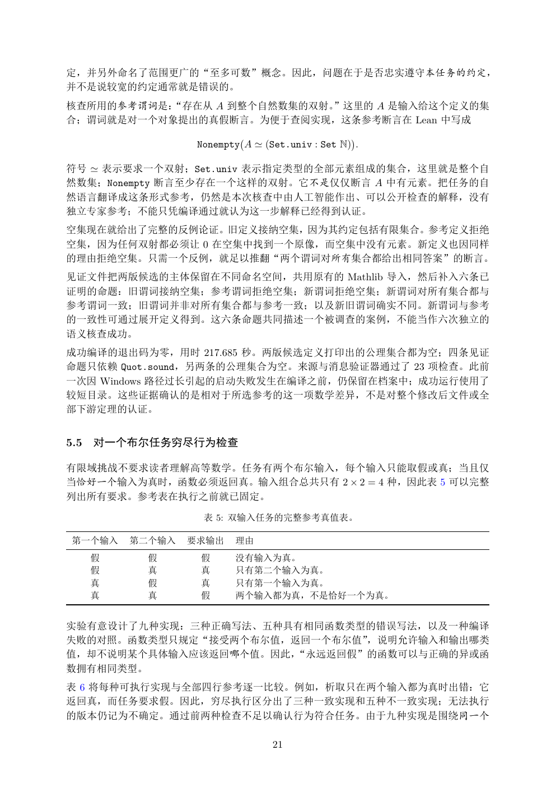

# PDF page 21



## Extracted text

```text
定，并另外命名了范围更广的“至多可数”概念。因此，问题在于是否忠实遵守本任务的约定，
并不是说较宽的约定通常就是错误的。
核查所用的参考谓词是：
          “存在从 A 到整个自然数集的双射。
                           ”这里的 A 是输入给这个定义的集
合；谓词就是对一个对象提出的真假断言。为便于查阅实现，这条参考断言在 Lean 中写成
                                                  
                   Nonempty A ≃ (Set.univ : Set N) .

符号 ≃ 表示要求一个双射；Set.univ 表示指定类型的全部元素组成的集合，这里就是整个自
然数集；Nonempty 断言至少存在一个这样的双射。它不是仅仅断言 A 中有元素。把任务的自
然语言翻译成这条形式参考，仍然是本次核查中由人工智能作出、可以公开检查的解释，没有
独立专家参考；不能只凭编译通过就认为这一步解释已经得到认证。
空集现在就给出了完整的反例论证。旧定义接纳空集，因为其约定包括有限集合。参考定义拒绝
空集，因为任何双射都必须让 0 在空集中找到一个原像，而空集中没有元素。新定义也因同样
的理由拒绝空集。只需一个反例，就足以推翻“两个谓词对所有集合都给出相同答案”的断言。
见证文件把两版候选的主体保留在不同命名空间，共用原有的 Mathlib 导入，然后补入六条已
证明的命题：旧谓词接纳空集；参考谓词拒绝空集；新谓词拒绝空集；新谓词对所有集合都与
参考谓词一致；旧谓词并非对所有集合都与参考一致；以及新旧谓词确实不同。新谓词与参考
的一致性可通过展开定义得到。这六条命题共同描述一个被调查的案例，不能当作六次独立的
语义核查成功。
成功编译的退出码为零，用时 217.685 秒。两版候选定义打印出的公理集合都为空；四条见证
命题只依赖 Quot.sound，另两条的公理集合为空。来源与消息验证器通过了 23 项检查。此前
一次因 Windows 路径过长引起的启动失败发生在编译之前，仍保留在档案中；成功运行使用了
较短目录。这些证据确认的是相对于所选参考的这一项数学差异，不是对整个修改后文件或全
部下游定理的认证。


5.5   对一个布尔任务穷尽行为检查

有限域挑战不要求读者理解高等数学。任务有两个布尔输入，每个输入只能取假或真；当且仅
当恰好一个输入为真时，函数必须返回真。输入组合总共只有 2 × 2 = 4 种，因此表 5 可以完整
列出所有要求。参考表在执行之前就已固定。

                    表 5: 双输入任务的完整参考真值表。

 第一个输入    第二个输入   要求输出    理由
      假    假       假      没有输入为真。
      假    真       真      只有第二个输入为真。
      真    假       真      只有第一个输入为真。
      真    真       假      两个输入都为真，不是恰好一个为真。


实验有意设计了九种实现：三种正确写法、五种具有相同函数类型的错误写法，以及一种编译
失败的对照。函数类型只规定“接受两个布尔值，返回一个布尔值”，说明允许输入和输出哪类
值，却不说明某个具体输入应该返回哪个值。因此，“永远返回假”的函数可以与正确的异或函
数拥有相同类型。
表 6 将每种可执行实现与全部四行参考逐一比较。例如，析取只在两个输入都为真时出错：它
返回真，而任务要求假。因此，穷尽执行区分出了三种一致实现和五种不一致实现；无法执行
的版本仍记为不确定。通过前两种检查不足以确认行为符合任务。由于九种实现是围绕同一个

                                  21
```
