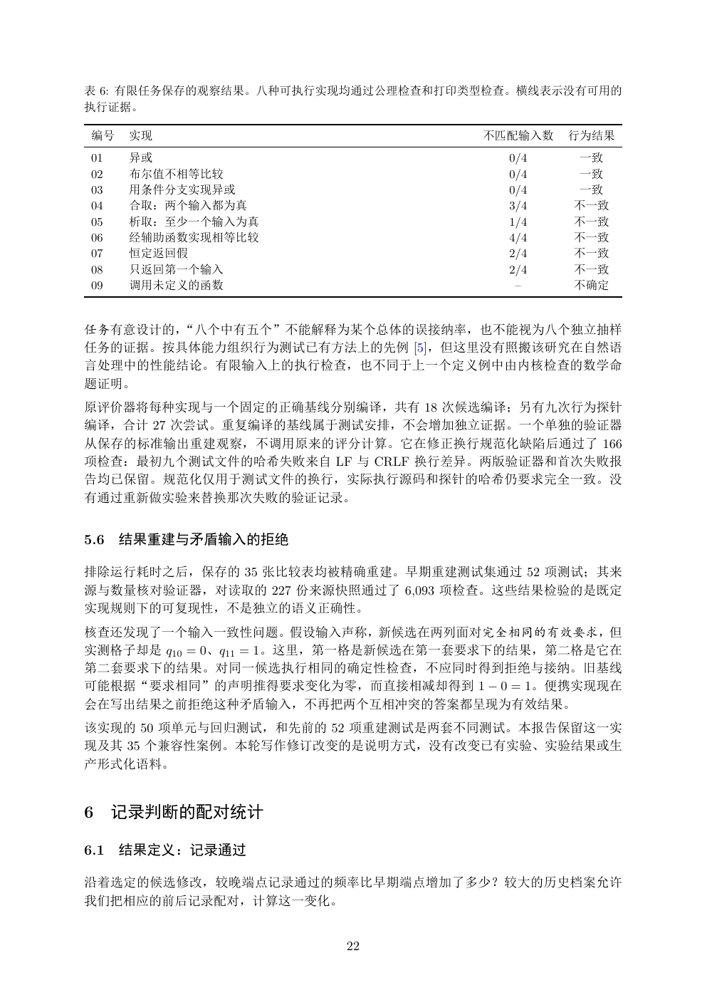

# PDF page 22



## Extracted text

```text
表 6: 有限任务保存的观察结果。八种可执行实现均通过公理检查和打印类型检查。横线表示没有可用的
执行证据。

 编号   实现                             不匹配输入数   行为结果
 01   异或                               0/4    一致
 02   布尔值不相等比较                         0/4    一致
 03   用条件分支实现异或                        0/4    一致
 04   合取：两个输入都为真                       3/4    不一致
 05   析取：至少一个输入为真                      1/4    不一致
 06   经辅助函数实现相等比较                      4/4    不一致
 07   恒定返回假                            2/4    不一致
 08   只返回第一个输入                         2/4    不一致
 09   调用未定义的函数                          –     不确定


任务有意设计的，“八个中有五个”不能解释为某个总体的误接纳率，也不能视为八个独立抽样
任务的证据。按具体能力组织行为测试已有方法上的先例 [5]，但这里没有照搬该研究在自然语
言处理中的性能结论。有限输入上的执行检查，也不同于上一个定义例中由内核检查的数学命
题证明。
原评价器将每种实现与一个固定的正确基线分别编译，共有 18 次候选编译；另有九次行为探针
编译，合计 27 次尝试。重复编译的基线属于测试安排，不会增加独立证据。一个单独的验证器
从保存的标准输出重建观察，不调用原来的评分计算。它在修正换行规范化缺陷后通过了 166
项检查：最初九个测试文件的哈希失败来自 LF 与 CRLF 换行差异。两版验证器和首次失败报
告均已保留。规范化仅用于测试文件的换行，实际执行源码和探针的哈希仍要求完全一致。没
有通过重新做实验来替换那次失败的验证记录。


5.6   结果重建与矛盾输入的拒绝

排除运行耗时之后，保存的 35 张比较表均被精确重建。早期重建测试集通过 52 项测试；其来
源与数量核对验证器，对读取的 227 份来源快照通过了 6,093 项检查。这些结果检验的是既定
实现规则下的可复现性，不是独立的语义正确性。
核查还发现了一个输入一致性问题。假设输入声称，新候选在两列面对完全相同的有效要求，但
实测格子却是 q10 = 0、q11 = 1。这里，第一格是新候选在第一套要求下的结果，第二格是它在
第二套要求下的结果。对同一候选执行相同的确定性检查，不应同时得到拒绝与接纳。旧基线
可能根据“要求相同”的声明推得要求变化为零，而直接相减却得到 1 − 0 = 1。便携实现现在
会在写出结果之前拒绝这种矛盾输入，不再把两个互相冲突的答案都呈现为有效结果。
该实现的 50 项单元与回归测试，和先前的 52 项重建测试是两套不同测试。本报告保留这一实
现及其 35 个兼容性案例。本轮写作修订改变的是说明方式，没有改变已有实验、实验结果或生
产形式化语料。


6 记录判断的配对统计

6.1   结果定义：记录通过

沿着选定的候选修改，较晚端点记录通过的频率比早期端点增加了多少？较大的历史档案允许
我们把相应的前后记录配对，计算这一变化。


                        22
```
