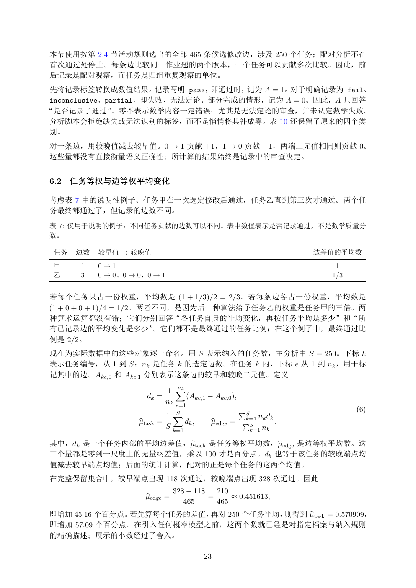

# PDF page 23



## Extracted text

```text
本节使用按第 2.4 节活动规则选出的全部 465 条候选修改边，涉及 250 个任务；配对分析不在
首次通过处停止。每条边比较同一作业题的两个版本，一个任务可以贡献多次比较。因此，前
后记录是配对观察，而任务是归组重复观察的单位。
先将记录标签转换成数值结果。记录写明 pass，即通过时，记为 A = 1。对于明确记录为 fail、
inconclusive、partial，即失败、无法定论、部分完成的情形，记为 A = 0。因此，A 只回答
“是否记录了通过”。零不表示数学内容一定错误；尤其是无法定论的审查，并未认定数学失败。
分析脚本会拒绝缺失或无法识别的标签，而不是悄悄将其补成零。表 10 还保留了原来的四个类
别。
对一条边，用较晚值减去较早值。0 → 1 贡献 +1，1 → 0 贡献 −1，两端二元值相同则贡献 0。
这些量都没有直接衡量语义正确性；所计算的结果始终是记录中的审查决定。


6.2   任务等权与边等权平均变化

考虑表 7 中的说明性例子。任务甲在一次选定修改后通过，任务乙直到第三次才通过。两个任
务最终都通过了，但记录的边数不同。
表 7: 仅用于说明的例子：不同任务贡献的边数可以不同。表中数值表示是否记录通过，不是数学质量分
数。

 任务   边数   较早值 → 较晚值                                                    边差值的平均数
 甲     1   0→1                                                             1
 乙     3   0 → 0、0 → 0、0 → 1                                              1/3


若每个任务只占一份权重，平均数是 (1 + 1/3)/2 = 2/3。若每条边各占一份权重，平均数是
(1 + 0 + 0 + 1)/4 = 1/2。两者不同，是因为后一种算法给予任务乙的权重是任务甲的三倍。两
种算术运算都没有错；它们分别回答“各任务自身的平均变化，再按任务平均是多少”和“所
有已记录边的平均变化是多少”。它们都不是最终通过的任务比例；在这个例子中，最终通过比
例是 2/2。
现在为实际数据中的这些对象逐一命名。用 S 表示纳入的任务数，主分析中 S = 250。下标 k
表示任务编号，从 1 到 S；nk 是任务 k 的选定边数。在任务 k 内，下标 e 从 1 到 nk ，用于标
记其中的边。Ake,0 和 Ake,1 分别表示这条边的较早和较晚二元值。定义

                               1 X
                                   nk
                       dk =           (Ake,1 − Ake,0 ),
                               nk e=1
                                                          PS                    (6)
                             1 XS
                                                          k=1 nk dk
                     btask =
                     µ             dk ,       bedge =
                                              µ           PS        .
                             S k=1                         k=1 nk

                    btask 是任务等权平均数，µ
其中，dk 是一个任务内部的平均边差值，µ              bedge 是边等权平均数。这
三个量都是零到一尺度上的无量纲差值，乘以 100 才是百分点。dk 也等于该任务的较晚端点均
值减去较早端点均值；后面的统计计算，配对的正是每个任务的这两个均值。
在完整保留集合中，较早端点出现 118 次通过，较晚端点出现 328 次通过。因此
                                 328 − 118   210
                       bedge =
                       µ                   =     ≈ 0.451613,
                                    465      465
                                           btask = 0.570909，
即增加 45.16 个百分点。若先算每个任务的差值，再对 250 个任务平均，则得到 µ
即增加 57.09 个百分点。在引入任何概率模型之前，这两个数就已经是对指定档案与纳入规则
的精确描述；展示的小数经过了舍入。

                                           23
```
