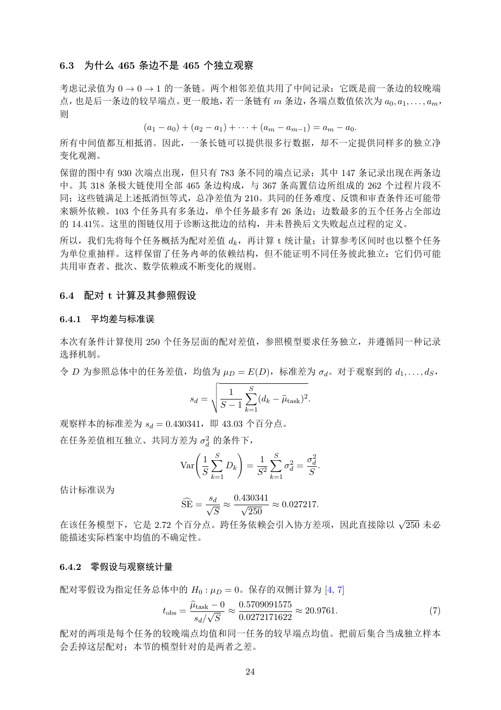

# PDF page 24



## Extracted text

```text
6.3     为什么 465 条边不是 465 个独立观察

考虑记录值为 0 → 0 → 1 的一条链。两个相邻差值共用了中间记录：它既是前一条边的较晚端
点，也是后一条边的较早端点。更一般地，若一条链有 m 条边，各端点数值依次为 a0 , a1 , . . . , am ，
则
             (a1 − a0 ) + (a2 − a1 ) + · · · + (am − am−1 ) = am − a0 .
所有中间值都互相抵消。因此，一条长链可以提供很多行数据，却不一定提供同样多的独立净
变化观测。
保留的图中有 930 次端点出现，但只有 783 条不同的端点记录；其中 147 条记录出现在两条边
中。其 318 条极大链使用全部 465 条边构成，与 367 条高置信边所组成的 262 个过程片段不
同；这些链满足上述抵消恒等式，总净差值为 210。共同的任务难度、反馈和审查条件还可能带
来额外依赖。103 个任务具有多条边，单个任务最多有 26 条边；边数最多的五个任务占全部边
的 14.41%。这里的图链仅用于诊断这批边的结构，并未替换后文失败起点过程的定义。
所以，我们先将每个任务概括为配对差值 dk ，再计算 t 统计量；计算参考区间时也以整个任务
为单位重抽样。这样保留了任务内部的依赖结构，但不能证明不同任务彼此独立：它们仍可能
共用审查者、批次、数学依赖或不断变化的规则。


6.4     配对 t 计算及其参照假设

6.4.1   平均差与标准误

本次有条件计算使用 250 个任务层面的配对差值，参照模型要求任务独立，并遵循同一种记录
选择机制。
令 D 为参照总体中的任务差值，均值为 µD = E(D)，标准差为 σd 。对于观察到的 d1 , . . . , dS ，
                                v
                                u
                                u     1 X  S
                           sd = t            (dk − µ
                                                   btask )2 .
                                    S − 1 k=1

观察样本的标准差为 sd = 0.430341，即 43.03 个百分点。
在任务差值相互独立、共同方差为 σd2 的条件下，
                                        !
                          1 XS
                                              1 X
                                                S
                                                        σ2
                      Var       Dk          = 2    σd2 = d .
                          S k=1              S k=1       S

估计标准误为
                     sd
                 c = √    0.430341
                 SE      ≈ √       ≈ 0.027217.
                       S      250
                                               √
在该任务模型下，它是 2.72 个百分点。跨任务依赖会引入协方差项，因此直接除以 250 未必
能描述实际档案中均值的不确定性。


6.4.2   零假设与观察统计量

配对零假设为指定任务总体中的 H0 : µD = 0。保存的双侧计算为 [4, 7]
                           btask − 0
                           µ         0.5709091575
                  tobs =        √ ≈               ≈ 20.9761.       (7)
                            sd / S   0.0272171622
配对的两项是每个任务的较晚端点均值和同一任务的较早端点均值。把前后集合当成独立样本
会丢掉这层配对；本节的模型针对的是两者之差。

                                            24
```
