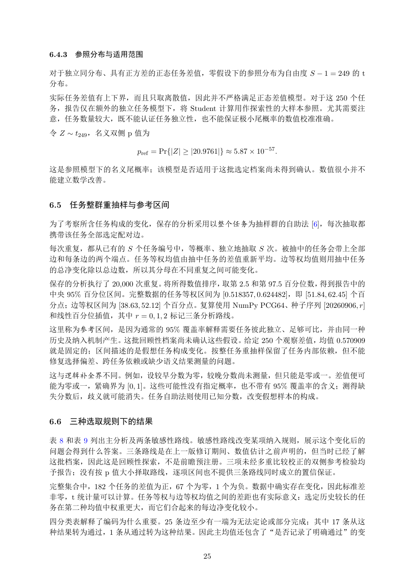

# PDF page 25



## Extracted text

```text
6.4.3   参照分布与适用范围

对于独立同分布、具有正方差的正态任务差值，零假设下的参照分布为自由度 S − 1 = 249 的 t
分布。
实际任务差值有上下界，而且只取离散值，因此并不严格满足正态差值模型。对于这 250 个任
务，报告仅在额外的独立任务模型下，将 Student 计算用作探索性的大样本参照。尤其需要注
意，任务数量较大，既不能认证任务独立性，也不能保证极小尾概率的数值校准准确。
令 Z ∼ t249 ，名义双侧 p 值为

                  pref = Pr{|Z| ≥ |20.9761|} ≈ 5.87 × 10−57 .

这是参照模型下的名义尾概率；该模型是否适用于这批选定档案尚未得到确认。数值很小并不
能建立数学改善。


6.5     任务整群重抽样与参考区间

为了考察所含任务构成的变化，保存的分析采用以整个任务为抽样群的自助法 [6]，每次抽取都
携带该任务全部选定配对边。
每次重复，都从已有的 S 个任务编号中，等概率、独立地抽取 S 次。被抽中的任务会带上全部
边和每条边的两个端点。任务等权均值由抽中任务的差值重新平均。边等权均值则用抽中任务
的总净变化除以总边数，所以其分母在不同重复之间可能变化。
保存的分析执行了 20,000 次重复。将所得数值排序，取第 2.5 和第 97.5 百分位数，得到报告中的
中央 95% 百分位区间。完整数据的任务等权区间为 [0.518357, 0.624482]，即 [51.84, 62.45] 个百
分点；边等权区间为 [38.63, 52.12] 个百分点。复算使用 NumPy PCG64、种子序列 [20260906, r]
和线性百分位插值，其中 r = 0, 1, 2 标记三条分析路线。
这里称为参考区间，是因为通常的 95% 覆盖率解释需要任务彼此独立、足够可比，并由同一种
历史及纳入机制产生。这批回顾性档案尚未确认这些假设。给定 250 个观察差值，均值 0.570909
就是固定的；区间描述的是假想任务构成变化。按整任务重抽样保留了任务内部依赖，但不能
修复选择偏差、跨任务依赖或缺少语义结果测量的问题。
这与逻辑补全界不同。例如，设较早分数为零，较晚分数尚未测量，但只能是零或一。差值便可
能为零或一，紧确界为 [0, 1]。这些可能性没有指定概率，也不带有 95% 覆盖率的含义；测得缺
失分数后，歧义就可能消失。任务自助法则使用已知分数，改变假想样本的构成。


6.6     三种选取规则下的结果

表 8 和表 9 列出主分析及两条敏感性路线。敏感性路线改变某项纳入规则，展示这个变化后的
问题会得到什么答案。三条路线是在上一版修订期间、数值估计之前声明的，但当时已经了解
这批档案，因此这是回顾性探索，不是前瞻预注册。三项未经多重比较校正的双侧参考检验均
予报告；没有按 p 值大小择取路线，逐项区间也不提供三条路线同时成立的置信保证。
完整集合中，182 个任务的差值为正，67 个为零，1 个为负。数据中确实存在变化，因此标准差
非零，t 统计量可以计算。任务等权与边等权均值之间的差距也有实际意义：选定历史较长的任
务在第二种均值中权重更大，而它们合起来的每边净变化较小。
四分类表解释了编码为什么重要。25 条边至少有一端为无法定论或部分完成；其中 17 条从这
种结果转为通过，1 条从通过转为这种结果。因此主均值还包含了“是否记录了明确通过”的变


                                      25
```
