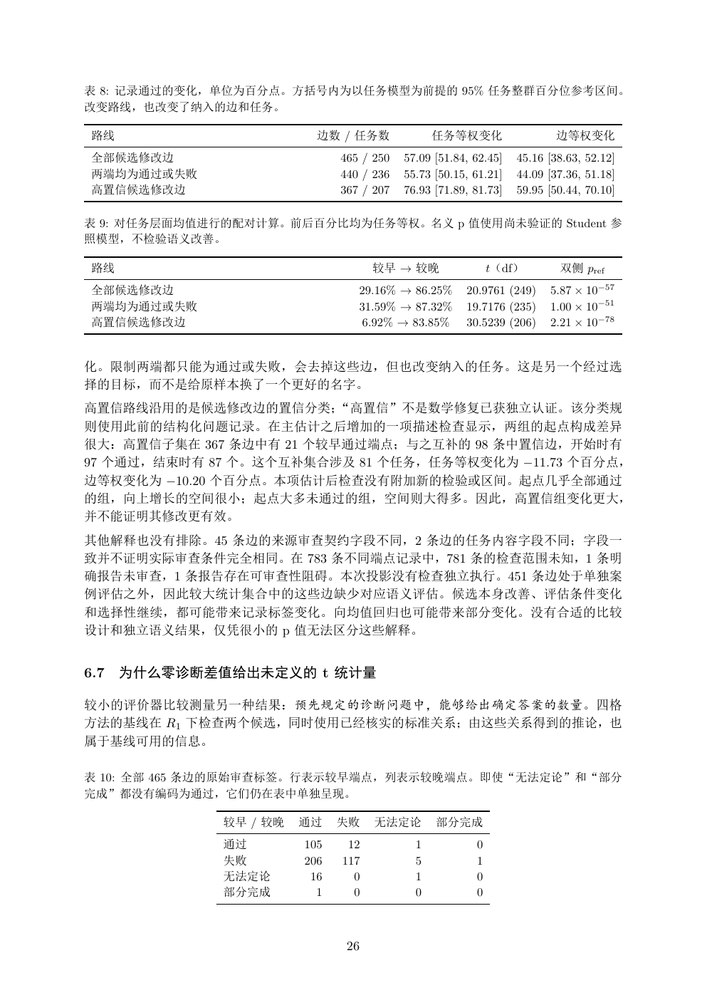

# PDF page 26



## Extracted text

```text
表 8: 记录通过的变化，单位为百分点。方括号内为以任务模型为前提的 95% 任务整群百分位参考区间。
改变路线，也改变了纳入的边和任务。

 路线                       边数 / 任务数              任务等权变化                   边等权变化
 全部候选修改边                      465 / 250   57.09 [51.84, 62.45]   45.16 [38.63, 52.12]
 两端均为通过或失败                    440 / 236   55.73 [50.15, 61.21]   44.09 [37.36, 51.18]
 高置信候选修改边                     367 / 207   76.93 [71.89, 81.73]   59.95 [50.44, 70.10]

表 9: 对任务层面均值进行的配对计算。前后百分比均为任务等权。名义 p 值使用尚未验证的 Student 参
照模型，不检验语义改善。

 路线                                 较早 → 较晚                 t（df）        双侧 pref
 全部候选修改边                         29.16% → 86.25%      20.9761 (249)    5.87 × 10−57
 两端均为通过或失败                       31.59% → 87.32%      19.7176 (235)    1.00 × 10−51
 高置信候选修改边                        6.92% → 83.85%       30.5239 (206)    2.21 × 10−78


化。限制两端都只能为通过或失败，会去掉这些边，但也改变纳入的任务。这是另一个经过选
择的目标，而不是给原样本换了一个更好的名字。
高置信路线沿用的是候选修改边的置信分类；“高置信”不是数学修复已获独立认证。该分类规
则使用此前的结构化问题记录。在主估计之后增加的一项描述检查显示，两组的起点构成差异
很大：高置信子集在 367 条边中有 21 个较早通过端点；与之互补的 98 条中置信边，开始时有
97 个通过，结束时有 87 个。这个互补集合涉及 81 个任务，任务等权变化为 −11.73 个百分点，
边等权变化为 −10.20 个百分点。本项估计后检查没有附加新的检验或区间。起点几乎全部通过
的组，向上增长的空间很小；起点大多未通过的组，空间则大得多。因此，高置信组变化更大，
并不能证明其修改更有效。
其他解释也没有排除。45 条边的来源审查契约字段不同，2 条边的任务内容字段不同；字段一
致并不证明实际审查条件完全相同。在 783 条不同端点记录中，781 条的检查范围未知，1 条明
确报告未审查，1 条报告存在可审查性阻碍。本次投影没有检查独立执行。451 条边处于单独案
例评估之外，因此较大统计集合中的这些边缺少对应语义评估。候选本身改善、评估条件变化
和选择性继续，都可能带来记录标签变化。向均值回归也可能带来部分变化。没有合适的比较
设计和独立语义结果，仅凭很小的 p 值无法区分这些解释。


6.7   为什么零诊断差值给出未定义的 t 统计量

较小的评价器比较测量另一种结果：预先规定的诊断问题中，能够给出确定答案的数量。四格
方法的基线在 R1 下检查两个候选，同时使用已经核实的标准关系；由这些关系得到的推论，也
属于基线可用的信息。

表 10: 全部 465 条边的原始审查标签。行表示较早端点，列表示较晚端点。即使“无法定论”和“部分
完成”都没有编码为通过，它们仍在表中单独呈现。

              较早 / 较晚   通过    失败    无法定论        部分完成
              通过        105    12           1           0
              失败        206   117           5           1
              无法定论       16     0           1           0
              部分完成        1     0           0           0


                               26
```
