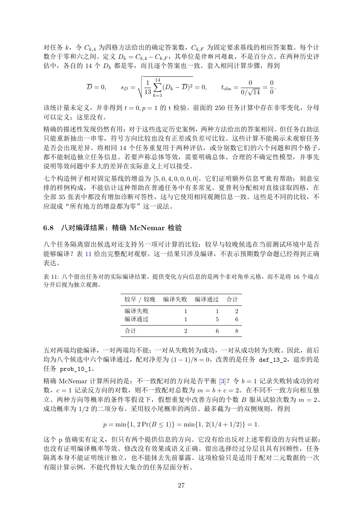

# PDF page 27



## Extracted text

```text
对任务 k，令 Ck,4 为四格方法给出的确定答案数，Ck,F 为固定要求基线的相应答案数。每个计
数介于零和六之间。定义 Dk = Ck,4 − Ck,F ，其单位是诊断问题数，不是百分点。在两种历史评
估中，各自的 14 个 Dk 都是零，而且逐个答案也一致。套入相同计算步骤，得到
                         v
                         u
                         u1 X
                            14
                                                                 0     0
          D = 0,    sD = t     (Dk − D)2 = 0,          tobs =    √    = .
                            13 k=1                              0/ 14  0

该统计量未定义，并非得到 t = 0, p = 1 的 t 检验。前面的 250 任务计算中存在非零变化，分母
可以定义；这里没有。
精确的描述性发现仍然有用：对于这些选定历史案例，两种方法给出的答案相同。但任务自助法
只能重新抽出一串零，符号方向比较也没有正差或负差可比较。这些计算不能揭示未观察任务
是否会出现差异。将相同 14 个任务重复用于两种评估，或分别数它们的六个问题和四个格子，
都不能制造独立任务信息。若要声称总体等效，需要明确总体、合理的不确定性模型，并事先
说明等效问题中多大的差异在实际意义上可以接受。
七个构造例子相对固定基线的增益为 [5, 0, 4, 0, 0, 0, 0]。它们证明额外信息可能有帮助；刻意安
排的样例构成，不能估计这种帮助在普通任务中有多常见。夏普利分配相对直接读取四格，在
全部 35 张表中都没有增加诊断可答性，这与它使用相同观测信息一致。这些是不同的比较，不
应混成“所有地方的增益都为零”这一说法。


6.8   八对编译结果：精确 McNemar 检验

八个任务隔离留出候选对还支持另一项可计算的比较：较早与较晚候选在当前测试环境中是否
能够编译？表 11 给出完整配对观察。这一结果只涉及编译，不表示预期数学命题已经得到正确
表达。

表 11: 八个留出任务对的实际编译结果。提供变化方向信息的是两个非对角单元格，而不是将 16 个端点
分开后视为独立观测。

                     较早 / 较晚         编译失败    编译通过       合计
                     编译失败                1         1       2
                     编译通过                1         5       6
                     合计                  2         6       8


五对两端均能编译，一对两端均不能；一对从失败转为成功，一对从成功转为失败。因此，前后
均为八个候选中六个编译通过，配对净差为 (1 − 1)/8 = 0。改善的是任务 def_13_2，退步的是
任务 prob_10_1。
精确 McNemar 计算所问的是：不一致配对的方向是否平衡 [3]？令 b = 1 记录失败转成功的对
数，c = 1 记录反方向的对数，则不一致配对总数为 m = b + c = 2。在不同不一致方向相互独
立、两种方向等概率的条件零假设下，假想重复中改善方向的个数 B 服从试验次数为 m = 2、
成功概率为 1/2 的二项分布。采用较小尾概率的两倍、最多截为一的双侧规则，得到

               p = min{1, 2 Pr(B ≤ 1)} = min{1, 2(1/4 + 1/2)} = 1.

这个 p 值确实有定义，但只有两个提供信息的方向。它没有给出反对上述零假设的方向性证据；
也没有证明编译概率等效、修改没有效果或语义正确。留出选择经过分层且具有回顾性，任务
隔离本身不能证明统计独立，也不能抹去先前暴露。这项检验只是适用于配对二元数据的一次
有限计算示例，不能代替较大集合的任务层面分析。

                                       27
```
