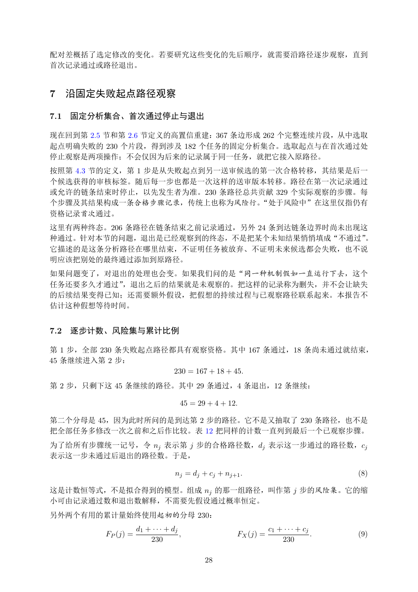

# PDF page 28



## Extracted text

```text
配对差概括了选定修改的变化。若要研究这些变化的先后顺序，就需要沿路径逐步观察，直到
首次记录通过或路径退出。


7 沿固定失败起点路径观察

7.1   固定分析集合、首次通过停止与退出

现在回到第 2.5 节和第 2.6 节定义的高置信重建：367 条边形成 262 个完整连续片段，从中选取
起点明确失败的 230 个片段，得到涉及 182 个任务的固定分析集合。选取起点与在首次通过处
停止观察是两项操作；不会仅因为后来的记录属于同一任务，就把它接入原路径。
按照第 4.3 节的定义，第 1 步是从失败起点到另一送审候选的第一次合格转移，其结果是后一
个候选获得的审核标签。随后每一步也都是一次这样的送审版本转移。路径在第一次记录通过
或允许的链条结束时停止，以先发生者为准。230 条路径总共贡献 329 个实际观察的步骤。每
个步骤及其结果构成一条合格步骤记录，传统上也称为风险行。“处于风险中”在这里仅指仍有
资格记录首次通过。
这里有两种终态。206 条路径在链条结束之前记录通过，另外 24 条到达链条边界时尚未出现这
种通过。针对本节的问题，退出是已经观察到的终态，不是把某个未知结果悄悄填成“不通过”    。
它描述的是这条分析路径在哪里结束，不证明任务被放弃、不证明未来候选都会失败，也不说
明应该把别处的最终通过添加到原路径。
如果问题变了，对退出的处理也会变。如果我们问的是“同一种机制假如一直运行下去，这个
任务还要多久才通过”，退出之后的结果就是未观察的。把这样的记录称为删失，并不会让缺失
的后续结果变得已知；还需要额外假设，把假想的持续过程与已观察路径联系起来。本报告不
估计这种假想等待时间。


7.2   逐步计数、风险集与累计比例

第 1 步，全部 230 条失败起点路径都具有观察资格。其中 167 条通过，18 条尚未通过就结束，
45 条继续进入第 2 步：
                     230 = 167 + 18 + 45.
第 2 步，只剩下这 45 条继续的路径。其中 29 条通过，4 条退出，12 条继续：

                                     45 = 29 + 4 + 12.

第二个分母是 45，因为此时所问的是到达第 2 步的路径。它不是又抽取了 230 条路径，也不是
把全部任务多修改一次之前和之后作比较。表 12 把同样的计数一直列到最后一个已观察步骤。
为了给所有步骤统一记号，令 nj 表示第 j 步的合格路径数，dj 表示这一步通过的路径数，cj
表示这一步未通过后退出的路径数。于是，

                                   nj = dj + cj + nj+1 .                             (8)

这是计数恒等式，不是拟合得到的模型。组成 nj 的那一组路径，叫作第 j 步的风险集。它的缩
小可由记录通过数和退出数解释，不需要先假设通过概率恒定。
另外两个有用的累计量始终使用起初的分母 230：
                     d1 + · · · + dj                             c1 + · · · + cj
          FP (j) =                   ,                FX (j) =                   .   (9)
                         230                                         230

                                            28
```
