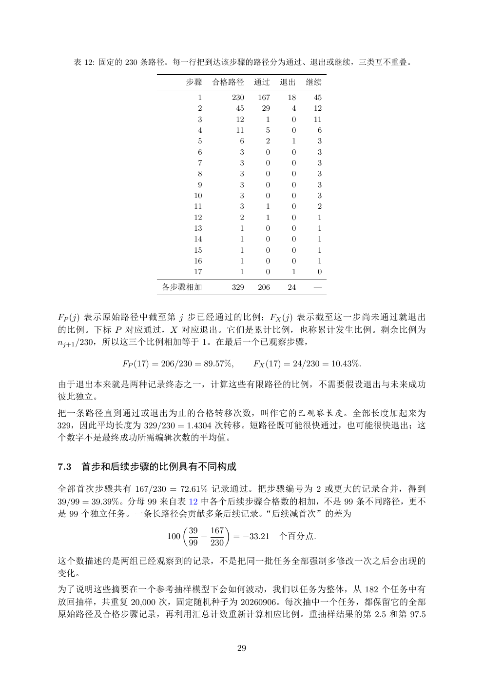

# PDF page 29



## Extracted text

```text
      表 12: 固定的 230 条路径。每一行把到达该步骤的路径分为通过、退出或继续，三类互不重叠。

                            步骤       合格路径          通过     退出    继续
                                 1           230    167    18    45
                                 2            45     29     4    12
                                 3            12      1     0    11
                                 4            11      5     0     6
                                 5             6      2     1     3
                                 6             3      0     0     3
                                 7             3      0     0     3
                                 8             3      0     0     3
                                 9             3      0     0     3
                                10             3      0     0     3
                                11             3      1     0     2
                                12             2      1     0     1
                                13             1      0     0     1
                                14             1      0     0     1
                                15             1      0     0     1
                                16             1      0     0     1
                                17             1      0     1     0
                     各步骤相加                   329    206    24    —


FP (j) 表示原始路径中截至第 j 步已经通过的比例；FX (j) 表示截至这一步尚未通过就退出
的比例。下标 P 对应通过，X 对应退出。它们是累计比例，也称累计发生比例。剩余比例为
nj+1 /230，所以这三个比例相加等于 1。在最后一个已观察步骤，

            FP (17) = 206/230 = 89.57%,            FX (17) = 24/230 = 10.43%.

由于退出本来就是两种记录终态之一，计算这些有限路径的比例，不需要假设退出与未来成功
彼此独立。
把一条路径直到通过或退出为止的合格转移次数，叫作它的已观察长度。全部长度加起来为
329，因此平均长度为 329/230 = 1.4304 次转移。短路径既可能很快通过，也可能很快退出；这
个数字不是最终成功所需编辑次数的平均值。


7.3    首步和后续步骤的比例具有不同构成

全部首次步骤共有 167/230 = 72.61% 记录通过。把步骤编号为 2 或更大的记录合并，得到
39/99 = 39.39%。分母 99 来自表 12 中各个后续步骤合格数的相加，不是 99 条不同路径，更不
是 99 个独立任务。一条长路径会贡献多条后续记录。“后续减首次”的差为
                                        
                                39 167
                      100         −          = −33.21     个百分点.
                                99 230

这个数描述的是两组已经观察到的记录，不是把同一批任务全部强制多修改一次之后会出现的
变化。
为了说明这些摘要在一个参考抽样模型下会如何波动，我们以任务为整体，从 182 个任务中有
放回抽样，共重复 20,000 次，固定随机种子为 20260906。每次抽中一个任务，都保留它的全部
原始路径及合格步骤记录，再利用汇总计数重新计算相应比例。重抽样结果的第 2.5 和第 97.5


                                              29
```
