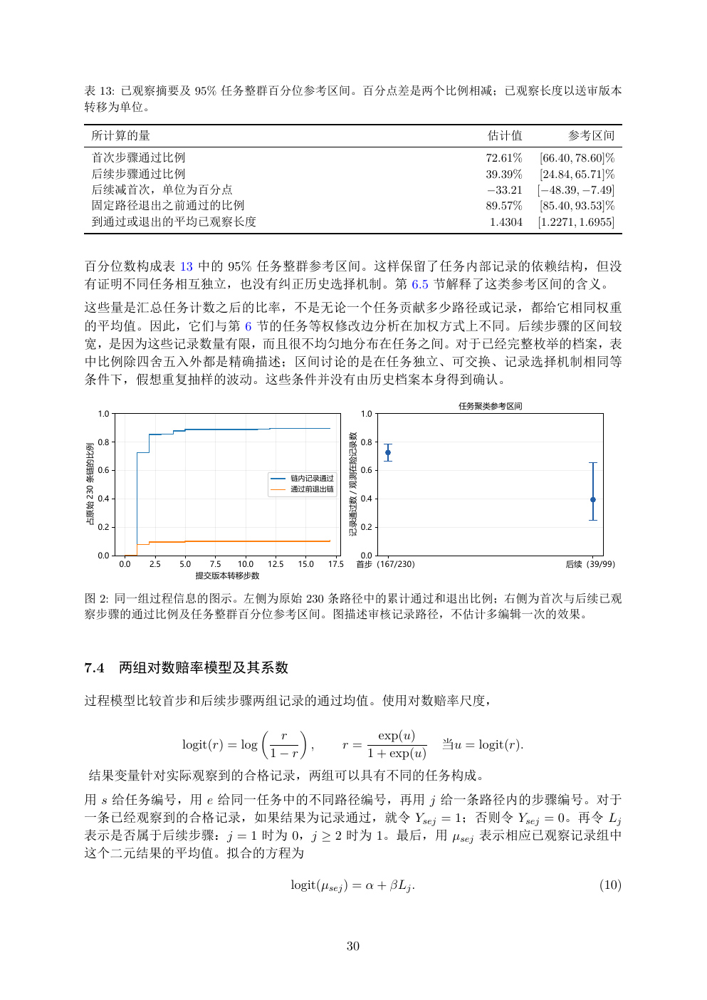

# PDF page 30



## Extracted text

```text
表 13: 已观察摘要及 95% 任务整群百分位参考区间。百分点差是两个比例相减；已观察长度以送审版本
转移为单位。

        所计算的量                                                                                                   估计值             参考区间
        首次步骤通过比例                                                                                                72.61%     [66.40, 78.60]%
        后续步骤通过比例                                                                                                39.39%     [24.84, 65.71]%
        后续减首次，单位为百分点                                                                                            −33.21    [−48.39, −7.49]
        固定路径退出之前通过的比例                                                                                           89.57%     [85.40, 93.53]%
        到通过或退出的平均已观察长度                                                                                           1.4304   [1.2271, 1.6955]


百分位数构成表 13 中的 95% 任务整群参考区间。这样保留了任务内部记录的依赖结构，但没
有证明不同任务相互独立，也没有纠正历史选择机制。第 6.5 节解释了这类参考区间的含义。
这些量是汇总任务计数之后的比率，不是无论一个任务贡献多少路径或记录，都给它相同权重
的平均值。因此，它们与第 6 节的任务等权修改边分析在加权方式上不同。后续步骤的区间较
宽，是因为这些记录数量有限，而且很不均匀地分布在任务之间。对于已经完整枚举的档案，表
中比例除四舍五入外都是精确描述；区间讨论的是在任务独立、可交换、记录选择机制相同等
条件下，假想重复抽样的波动。这些条件并没有由历史档案本身得到确认。
                                                                                                           任务聚类参考区间
                1.0                                                                        1.0
                                                                           记录通过数／观测在险记录数


                0.8                                                                        0.8
占原始 230 条链的比例


                0.6                                                                        0.6
                                                            链内记录通过
                                                            通过前退出链
                0.4                                                                        0.4


                0.2                                                                        0.2


                0.0                                                                    0.0
                      0.0   2.5   5.0     7.5 10.0   12.5    15.0   17.5              首步（167/230）                              后续（39/99）
                                        提交版本转移步数

图 2: 同一组过程信息的图示。左侧为原始 230 条路径中的累计通过和退出比例；右侧为首次与后续已观
察步骤的通过比例及任务整群百分位参考区间。图描述审核记录路径，不估计多编辑一次的效果。


7.4                   两组对数赔率模型及其系数

过程模型比较首步和后续步骤两组记录的通过均值。使用对数赔率尺度，

                                                            
                                                          r                                   exp(u)
                                  logit(r) = log             ,         r=                                当u = logit(r).
                                                         1−r                                1 + exp(u)
    结果变量针对实际观察到的合格记录，两组可以具有不同的任务构成。
用 s 给任务编号，用 e 给同一任务中的不同路径编号，再用 j 给一条路径内的步骤编号。对于
一条已经观察到的合格记录，如果结果为记录通过，就令 Ysej = 1；否则令 Ysej = 0。再令 Lj
表示是否属于后续步骤：j = 1 时为 0，j ≥ 2 时为 1。最后，用 µsej 表示相应已观察记录组中
这个二元结果的平均值。拟合的方程为

                                                            logit(µsej ) = α + βLj .                                                  (10)


                                                                           30
```
