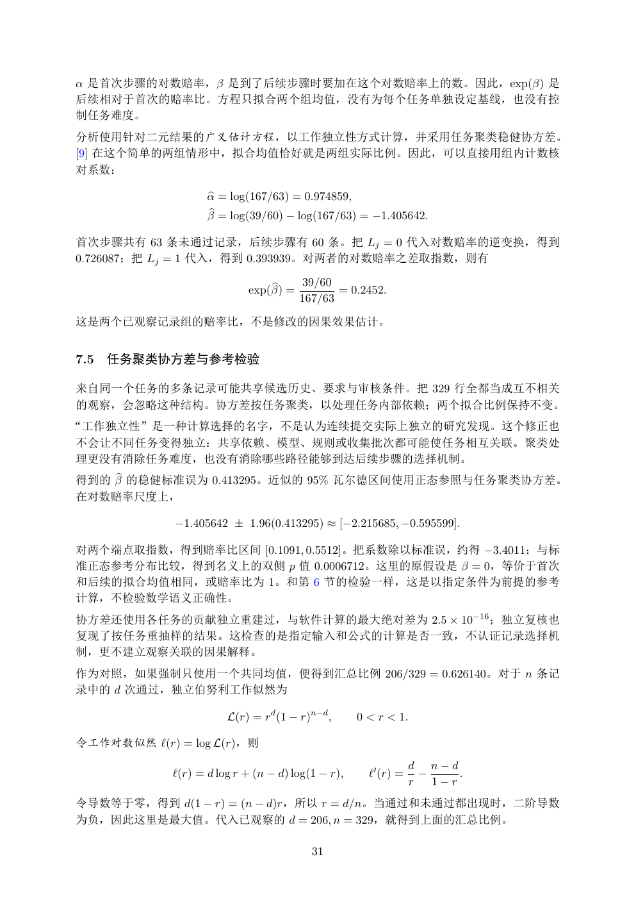

# PDF page 31



## Extracted text

```text
α 是首次步骤的对数赔率，β 是到了后续步骤时要加在这个对数赔率上的数。因此，exp(β) 是
后续相对于首次的赔率比。方程只拟合两个组均值，没有为每个任务单独设定基线，也没有控
制任务难度。
分析使用针对二元结果的广义估计方程，以工作独立性方式计算，并采用任务聚类稳健协方差。
[9] 在这个简单的两组情形中，拟合均值恰好就是两组实际比例。因此，可以直接用组内计数核
对系数：

                    b = log(167/63) = 0.974859,
                    α
                    βb = log(39/60) − log(167/63) = −1.405642.

首次步骤共有 63 条未通过记录，后续步骤有 60 条。把 Lj = 0 代入对数赔率的逆变换，得到
0.726087；把 Lj = 1 代入，得到 0.393939。对两者的对数赔率之差取指数，则有

                                b =     39/60
                            exp(β)            = 0.2452.
                                       167/63

这是两个已观察记录组的赔率比，不是修改的因果效果估计。


7.5   任务聚类协方差与参考检验

来自同一个任务的多条记录可能共享候选历史、要求与审核条件。把 329 行全都当成互不相关
的观察，会忽略这种结构。协方差按任务聚类，以处理任务内部依赖；两个拟合比例保持不变。
“工作独立性”是一种计算选择的名字，不是认为连续提交实际上独立的研究发现。这个修正也
不会让不同任务变得独立：共享依赖、模型、规则或收集批次都可能使任务相互关联。聚类处
理更没有消除任务难度，也没有消除哪些路径能够到达后续步骤的选择机制。
得到的 βb 的稳健标准误为 0.413295。近似的 95% 瓦尔德区间使用正态参照与任务聚类协方差。
在对数赔率尺度上，

             −1.405642 ± 1.96(0.413295) ≈ [−2.215685, −0.595599].

对两个端点取指数，得到赔率比区间 [0.1091, 0.5512]。把系数除以标准误，约得 −3.4011；与标
准正态参考分布比较，得到名义上的双侧 p 值 0.0006712。这里的原假设是 β = 0，等价于首次
和后续的拟合均值相同，或赔率比为 1。和第 6 节的检验一样，这是以指定条件为前提的参考
计算，不检验数学语义正确性。
协方差还使用各任务的贡献独立重建过，与软件计算的最大绝对差为 2.5 × 10−16 ；独立复核也
复现了按任务重抽样的结果。这检查的是指定输入和公式的计算是否一致，不认证记录选择机
制，更不建立观察关联的因果解释。
作为对照，如果强制只使用一个共同均值，便得到汇总比例 206/329 = 0.626140。对于 n 条记
录中的 d 次通过，独立伯努利工作似然为

                        L(r) = rd (1 − r)n−d ,      0 < r < 1.

令工作对数似然 ℓ(r) = log L(r)，则
                                                                 d n−d
             ℓ(r) = d log r + (n − d) log(1 − r),     ℓ′ (r) =     −     .
                                                                 r   1−r
令导数等于零，得到 d(1 − r) = (n − d)r，所以 r = d/n。当通过和未通过都出现时，二阶导数
为负，因此这里是最大值。代入已观察的 d = 206, n = 329，就得到上面的汇总比例。

                                          31
```
