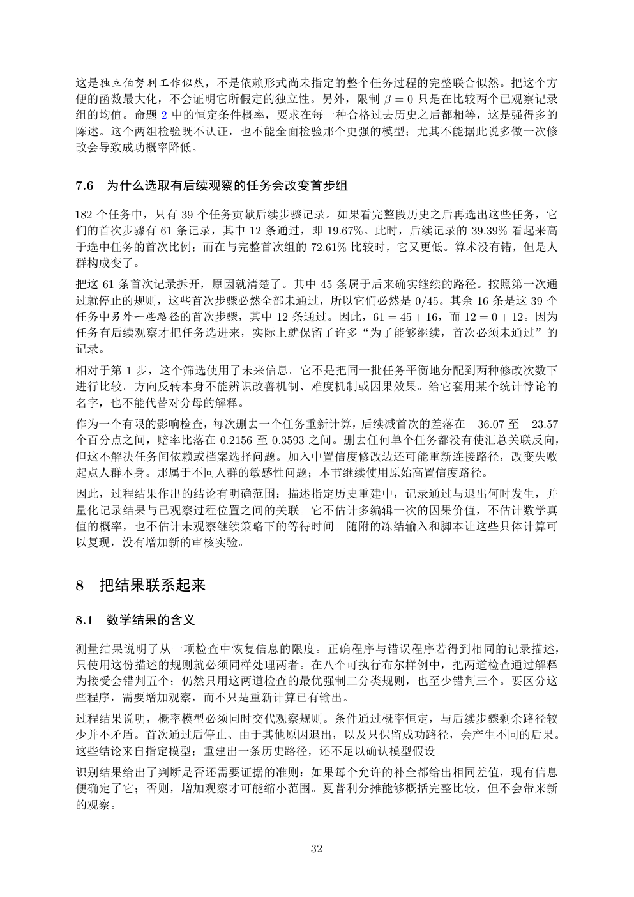

# PDF page 32



## Extracted text

```text
这是独立伯努利工作似然，不是依赖形式尚未指定的整个任务过程的完整联合似然。把这个方
便的函数最大化，不会证明它所假定的独立性。另外，限制 β = 0 只是在比较两个已观察记录
组的均值。命题 2 中的恒定条件概率，要求在每一种合格过去历史之后都相等，这是强得多的
陈述。这个两组检验既不认证，也不能全面检验那个更强的模型；尤其不能据此说多做一次修
改会导致成功概率降低。


7.6   为什么选取有后续观察的任务会改变首步组

182 个任务中，只有 39 个任务贡献后续步骤记录。如果看完整段历史之后再选出这些任务，它
们的首次步骤有 61 条记录，其中 12 条通过，即 19.67%。此时，后续记录的 39.39% 看起来高
于选中任务的首次比例；而在与完整首次组的 72.61% 比较时，它又更低。算术没有错，但是人
群构成变了。
把这 61 条首次记录拆开，原因就清楚了。其中 45 条属于后来确实继续的路径。按照第一次通
过就停止的规则，这些首次步骤必然全部未通过，所以它们必然是 0/45。其余 16 条是这 39 个
任务中另外一些路径的首次步骤，其中 12 条通过。因此，61 = 45 + 16，而 12 = 0 + 12。因为
任务有后续观察才把任务选进来，实际上就保留了许多“为了能够继续，首次必须未通过”的
记录。
相对于第 1 步，这个筛选使用了未来信息。它不是把同一批任务平衡地分配到两种修改次数下
进行比较。方向反转本身不能辨识改善机制、难度机制或因果效果。给它套用某个统计悖论的
名字，也不能代替对分母的解释。
作为一个有限的影响检查，每次删去一个任务重新计算，后续减首次的差落在 −36.07 至 −23.57
个百分点之间，赔率比落在 0.2156 至 0.3593 之间。删去任何单个任务都没有使汇总关联反向，
但这不解决任务间依赖或档案选择问题。加入中置信度修改边还可能重新连接路径，改变失败
起点人群本身。那属于不同人群的敏感性问题；本节继续使用原始高置信度路径。
因此，过程结果作出的结论有明确范围：描述指定历史重建中，记录通过与退出何时发生，并
量化记录结果与已观察过程位置之间的关联。它不估计多编辑一次的因果价值，不估计数学真
值的概率，也不估计未观察继续策略下的等待时间。随附的冻结输入和脚本让这些具体计算可
以复现，没有增加新的审核实验。


8 把结果联系起来

8.1   数学结果的含义

测量结果说明了从一项检查中恢复信息的限度。正确程序与错误程序若得到相同的记录描述，
只使用这份描述的规则就必须同样处理两者。在八个可执行布尔样例中，把两道检查通过解释
为接受会错判五个；仍然只用这两道检查的最优强制二分类规则，也至少错判三个。要区分这
些程序，需要增加观察，而不只是重新计算已有输出。
过程结果说明，概率模型必须同时交代观察规则。条件通过概率恒定，与后续步骤剩余路径较
少并不矛盾。首次通过后停止、由于其他原因退出，以及只保留成功路径，会产生不同的后果。
这些结论来自指定模型；重建出一条历史路径，还不足以确认模型假设。
识别结果给出了判断是否还需要证据的准则：如果每个允许的补全都给出相同差值，现有信息
便确定了它；否则，增加观察才可能缩小范围。夏普利分摊能够概括完整比较，但不会带来新
的观察。


                           32
```
