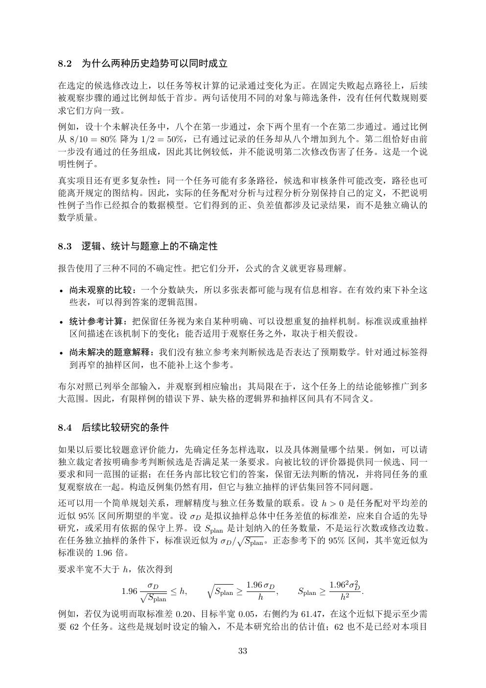

# PDF page 33



## Extracted text

```text
8.2   为什么两种历史趋势可以同时成立

在选定的候选修改边上，以任务等权计算的记录通过变化为正。在固定失败起点路径上，后续
被观察步骤的通过比例却低于首步。两句话使用不同的对象与筛选条件，没有任何代数规则要
求它们方向一致。
例如，设十个未解决任务中，八个在第一步通过，余下两个里有一个在第二步通过。通过比例
从 8/10 = 80% 降为 1/2 = 50%，已有通过记录的任务却从八个增加到九个。第二组恰好由前
一步没有通过的任务组成，因此其比例较低，并不能说明第二次修改伤害了任务。这是一个说
明性例子。
真实项目还有更多复杂性：同一个任务可能有多条路径，候选和审核条件可能改变，路径也可
能离开规定的图结构。因此，实际的任务配对分析与过程分析分别保持自己的定义，不把说明
性例子当作已经拟合的数据模型。它们得到的正、负差值都涉及记录结果，而不是独立确认的
数学质量。


8.3   逻辑、统计与题意上的不确定性

报告使用了三种不同的不确定性。把它们分开，公式的含义就更容易理解。

• 尚未观察的比较：一个分数缺失，所以多张表都可能与现有信息相容。在有效约束下补全这
  些表，可以得到答案的逻辑范围。

• 统计参考计算：把保留任务视为来自某种明确、可以设想重复的抽样机制。标准误或重抽样
  区间描述在该机制下的变化；能否适用于观察任务之外，取决于相关假设。

• 尚未解决的题意解释：我们没有独立参考来判断候选是否表达了预期数学。针对通过标签得
  到再窄的抽样区间，也不能补上这个参考。

布尔对照已列举全部输入，并观察到相应输出；其局限在于，这个任务上的结论能够推广到多
大范围。因此，有限样例的错误下界、缺失格的逻辑界和抽样区间具有不同含义。


8.4   后续比较研究的条件

如果以后要比较题意评价能力，先确定任务怎样选取，以及具体测量哪个结果。例如，可以请
独立裁定者按明确参考判断候选是否满足某一条要求。向被比较的评价器提供同一候选、同一
要求和同一范围的证据；在任务内部比较它们的答案，保留无法判断的情况，并将同任务的重
复观察放在一起。构造反例集仍然有用，但它与独立抽样的评估集回答不同问题。
还可以用一个简单规划关系，理解精度与独立任务数量的联系。设 h > 0 是任务配对平均差的
近似 95% 区间所期望的半宽。设 σD 是拟议抽样总体中任务差值的标准差，应来自合适的先导
研究，或采用有依据的保守上界。设 Splan 是计划纳入的任务数量，不是运行次数或修改边数。
                         p
在任务独立抽样的条件下，标准误近似为 σD / Splan 。正态参考下的 95% 区间，其半宽近似为
标准误的 1.96 倍。
要求半宽不大于 h，依次得到
                σD            q             1.96 σD               1.962 σD
                                                                         2
          1.96 p       ≤ h,       Splan ≥           ,   Splan ≥            .
                 Splan                         h                     h2
例如，若仅为说明而取标准差 0.20、目标半宽 0.05，右侧约为 61.47，在这个近似下提示至少需
要 62 个任务。这些是规划时设定的输入，不是本研究给出的估计值；62 也不是已经对本项目

                                       33
```
