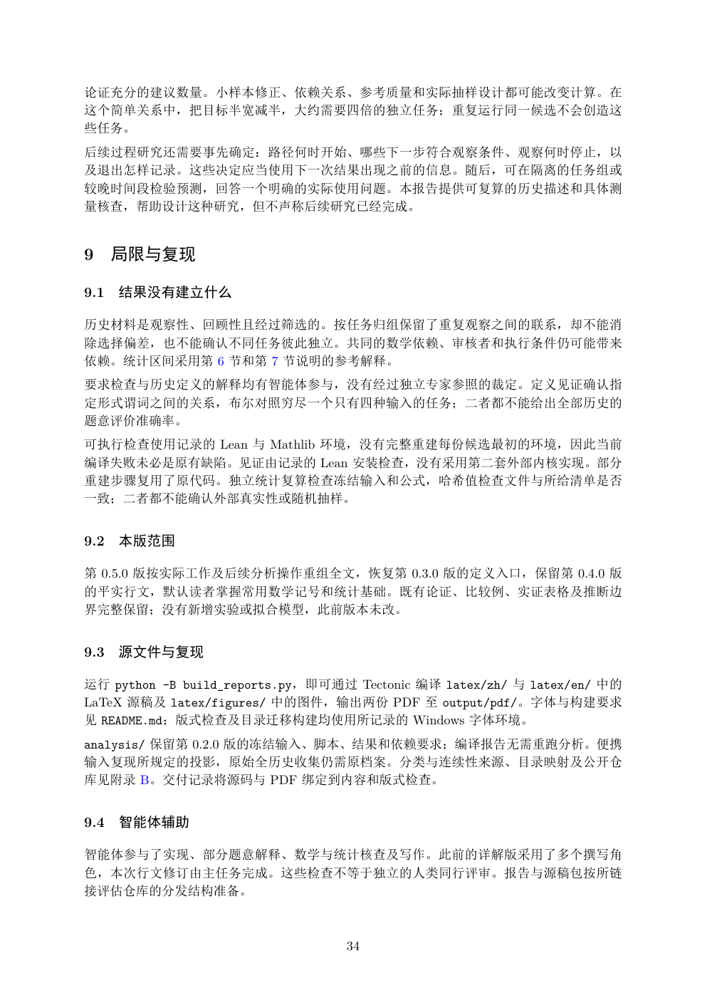

# PDF page 34



## Extracted text

```text
论证充分的建议数量。小样本修正、依赖关系、参考质量和实际抽样设计都可能改变计算。在
这个简单关系中，把目标半宽减半，大约需要四倍的独立任务；重复运行同一候选不会创造这
些任务。
后续过程研究还需要事先确定：路径何时开始、哪些下一步符合观察条件、观察何时停止，以
及退出怎样记录。这些决定应当使用下一次结果出现之前的信息。随后，可在隔离的任务组或
较晚时间段检验预测，回答一个明确的实际使用问题。本报告提供可复算的历史描述和具体测
量核查，帮助设计这种研究，但不声称后续研究已经完成。


9 局限与复现

9.1   结果没有建立什么

历史材料是观察性、回顾性且经过筛选的。按任务归组保留了重复观察之间的联系，却不能消
除选择偏差，也不能确认不同任务彼此独立。共同的数学依赖、审核者和执行条件仍可能带来
依赖。统计区间采用第 6 节和第 7 节说明的参考解释。
要求检查与历史定义的解释均有智能体参与，没有经过独立专家参照的裁定。定义见证确认指
定形式谓词之间的关系，布尔对照穷尽一个只有四种输入的任务；二者都不能给出全部历史的
题意评价准确率。
可执行检查使用记录的 Lean 与 Mathlib 环境，没有完整重建每份候选最初的环境，因此当前
编译失败未必是原有缺陷。见证由记录的 Lean 安装检查，没有采用第二套外部内核实现。部分
重建步骤复用了原代码。独立统计复算检查冻结输入和公式，哈希值检查文件与所给清单是否
一致；二者都不能确认外部真实性或随机抽样。


9.2   本版范围

第 0.5.0 版按实际工作及后续分析操作重组全文，恢复第 0.3.0 版的定义入口，保留第 0.4.0 版
的平实行文，默认读者掌握常用数学记号和统计基础。既有论证、比较例、实证表格及推断边
界完整保留；没有新增实验或拟合模型，此前版本未改。


9.3   源文件与复现

运行 python -B build_reports.py，即可通过 Tectonic 编译 latex/zh/ 与 latex/en/ 中的
LaTeX 源稿及 latex/figures/ 中的图件，输出两份 PDF 至 output/pdf/。字体与构建要求
见 README.md；版式检查及目录迁移构建均使用所记录的 Windows 字体环境。
analysis/ 保留第 0.2.0 版的冻结输入、脚本、结果和依赖要求；编译报告无需重跑分析。便携
输入复现所规定的投影，原始全历史收集仍需原档案。分类与连续性来源、目录映射及公开仓
库见附录 B。交付记录将源码与 PDF 绑定到内容和版式检查。


9.4   智能体辅助

智能体参与了实现、部分题意解释、数学与统计核查及写作。此前的详解版采用了多个撰写角
色，本次行文修订由主任务完成。这些检查不等于独立的人类同行评审。报告与源稿包按所链
接评估仓库的分发结构准备。


                                  34
```
