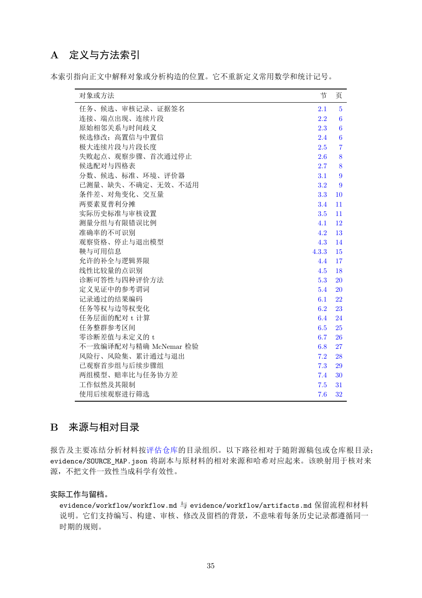

# PDF page 35



## Extracted text

```text
A 定义与方法索引

本索引指向正文中解释对象或分析构造的位置。它不重新定义常用数学和统计记号。

      对象或方法                                                 节     页
      任务、候选、审核记录、证据签名                                       2.1    5
      连接、端点出现、连续片段                                          2.2    6
      原始相邻关系与时间歧义                                           2.3    6
      候选修改；高置信与中置信                                          2.4    6
      极大连续片段与片段长度                                           2.5    7
      失败起点、观察步骤、首次通过停止                                      2.6    8
      候选配对与四格表                                              2.7    8
      分数、候选、标准、环境、评价器                                       3.1    9
      已测量、缺失、不确定、无效、不适用                                     3.2    9
      条件差、对角变化、交互量                                          3.3   10
      两要素夏普利分摊                                              3.4   11
      实际历史标准与审核设置                                           3.5   11
      测量分组与有限错误比例                                           4.1   12
      准确率的不可识别                                              4.2   13
      观察资格、停止与退出模型                                          4.3   14
      鞅与可用信息                                              4.3.3   15
      允许的补全与逻辑界限                                            4.4   17
      线性比较量的点识别                                             4.5   18
      诊断可答性与四种评价方法                                          5.3   20
      定义见证中的参考谓词                                            5.4   20
      记录通过的结果编码                                             6.1   22
      任务等权与边等权变化                                            6.2   23
      任务层面的配对 t 计算                                          6.4   24
      任务整群参考区间                                              6.5   25
      零诊断差值与未定义的 t                                          6.7   26
      不一致编译配对与精确 McNemar 检验                                 6.8   27
      风险行、风险集、累计通过与退出                                       7.2   28
      已观察首步组与后续步骤组                                          7.3   29
      两组模型、赔率比与任务协方差                                        7.4   30
      工作似然及其限制                                              7.5   31
      使用后续观察进行筛选                                            7.6   32


B 来源与相对目录

报告及主要冻结分析材料按评估仓库的目录组织。以下路径相对于随附源稿包或仓库根目录；
evidence/SOURCE_MAP.json 将副本与原材料的相对来源和哈希对应起来。该映射用于核对来
源，不把文件一致性当成科学有效性。

实际工作与留档。
 evidence/workflow/workflow.md 与 evidence/workflow/artifacts.md 保留流程和材料
 说明。它们支持编写、构建、审核、修改及留档的背景，不意味着每条历史记录都遵循同一
 时期的规则。


                                  35
```
