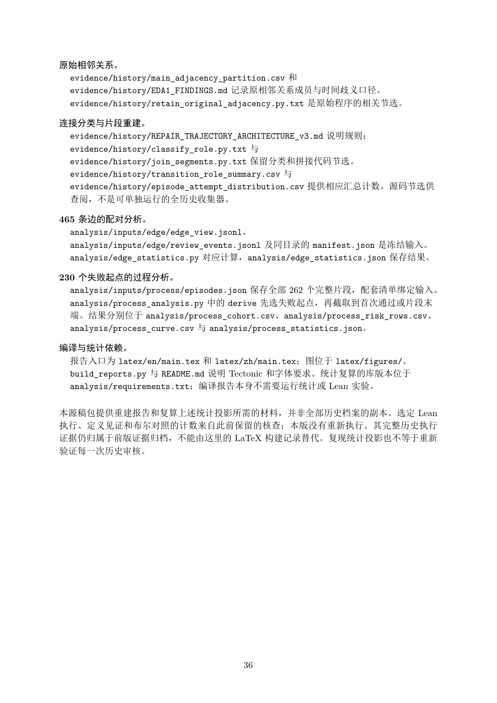

# PDF page 36



## Extracted text

```text
原始相邻关系。
 evidence/history/main_adjacency_partition.csv 和
 evidence/history/EDA1_FINDINGS.md 记录原相邻关系成员与时间歧义口径。
 evidence/history/retain_original_adjacency.py.txt 是原始程序的相关节选。

连接分类与片段重建。
 evidence/history/REPAIR_TRAJECTORY_ARCHITECTURE_v3.md 说明规则；
 evidence/history/classify_role.py.txt 与
 evidence/history/join_segments.py.txt 保留分类和拼接代码节选。
 evidence/history/transition_role_summary.csv 与
 evidence/history/episode_attempt_distribution.csv 提供相应汇总计数。源码节选供
 查阅，不是可单独运行的全历史收集器。

465 条边的配对分析。
  analysis/inputs/edge/edge_view.jsonl、
  analysis/inputs/edge/review_events.jsonl 及同目录的 manifest.json 是冻结输入。
  analysis/edge_statistics.py 对应计算，analysis/edge_statistics.json 保存结果。

230 个失败起点的过程分析。
  analysis/inputs/process/episodes.json 保存全部 262 个完整片段，配套清单绑定输入。
  analysis/process_analysis.py 中的 derive 先选失败起点，再截取到首次通过或片段末
  端。结果分别位于 analysis/process_cohort.csv、analysis/process_risk_rows.csv、
  analysis/process_curve.csv 与 analysis/process_statistics.json。

编译与统计依赖。
 报告入口为 latex/en/main.tex 和 latex/zh/main.tex；图位于 latex/figures/。
 build_reports.py 与 README.md 说明 Tectonic 和字体要求。统计复算的库版本位于
 analysis/requirements.txt；编译报告本身不需要运行统计或 Lean 实验。

本源稿包提供重建报告和复算上述统计投影所需的材料，并非全部历史档案的副本。选定 Lean
执行、定义见证和布尔对照的计数来自此前保留的核查；本版没有重新执行。其完整历史执行
证据仍归属于前版证据归档，不能由这里的 LaTeX 构建记录替代。复现统计投影也不等于重新
验证每一次历史审核。


                                  36
```
