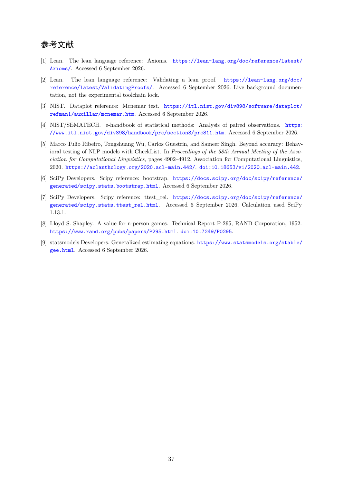

# PDF page 37



## Extracted text

```text
参考文献
[1] Lean. The lean language reference: Axioms. https://lean-lang.org/doc/reference/latest/
    Axioms/. Accessed 6 September 2026.
[2] Lean. The lean language reference: Validating a lean proof. https://lean-lang.org/doc/
    reference/latest/ValidatingProofs/. Accessed 6 September 2026. Live background documen-
    tation, not the experimental toolchain lock.
[3] NIST. Dataplot reference: Mcnemar test. https://itl.nist.gov/div898/software/dataplot/
    refman1/auxillar/mcnemar.htm. Accessed 6 September 2026.
[4] NIST/SEMATECH. e-handbook of statistical methods: Analysis of paired observations. https:
    //www.itl.nist.gov/div898/handbook/prc/section3/prc311.htm. Accessed 6 September 2026.
[5] Marco Tulio Ribeiro, Tongshuang Wu, Carlos Guestrin, and Sameer Singh. Beyond accuracy: Behav-
    ioral testing of NLP models with CheckList. In Proceedings of the 58th Annual Meeting of the Asso-
    ciation for Computational Linguistics, pages 4902–4912. Association for Computational Linguistics,
    2020. https://aclanthology.org/2020.acl-main.442/. doi:10.18653/v1/2020.acl-main.442.
[6] SciPy Developers. Scipy reference: bootstrap. https://docs.scipy.org/doc/scipy/reference/
    generated/scipy.stats.bootstrap.html. Accessed 6 September 2026.
[7] SciPy Developers. Scipy reference: ttest_rel. https://docs.scipy.org/doc/scipy/reference/
    generated/scipy.stats.ttest_rel.html. Accessed 6 September 2026. Calculation used SciPy
    1.13.1.
[8] Lloyd S. Shapley. A value for n-person games. Technical Report P-295, RAND Corporation, 1952.
    https://www.rand.org/pubs/papers/P295.html. doi:10.7249/P0295.
[9] statsmodels Developers. Generalized estimating equations. https://www.statsmodels.org/stable/
    gee.html. Accessed 6 September 2026.


                                                 37
```
